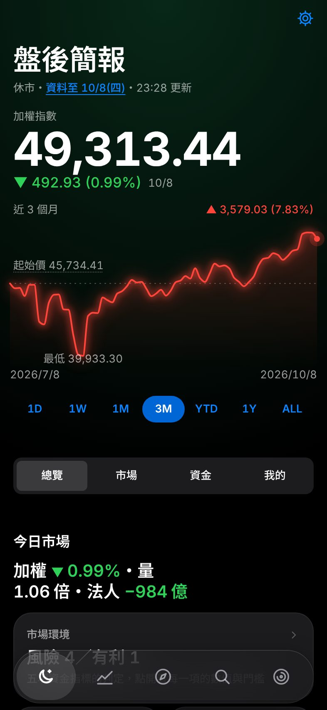
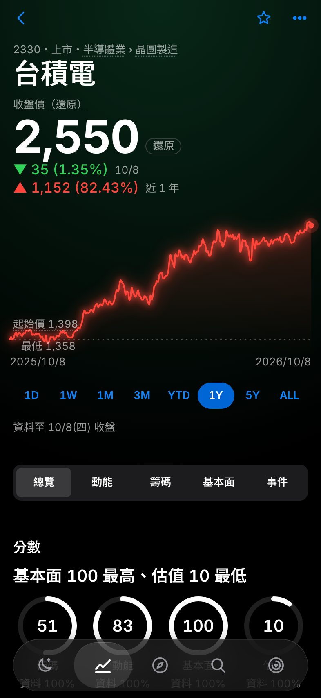
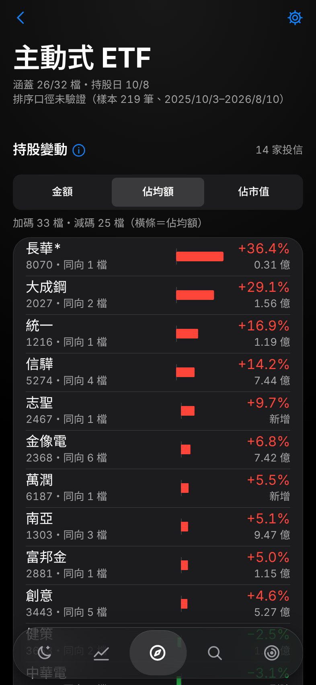
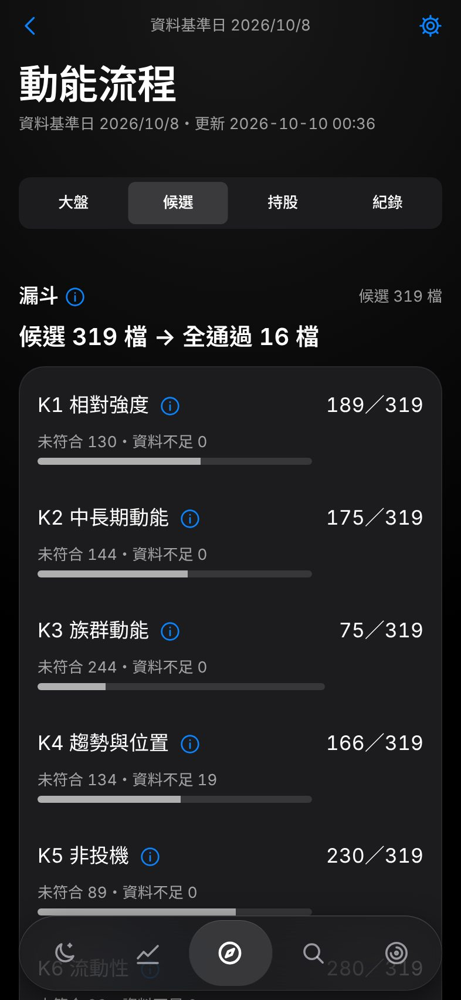
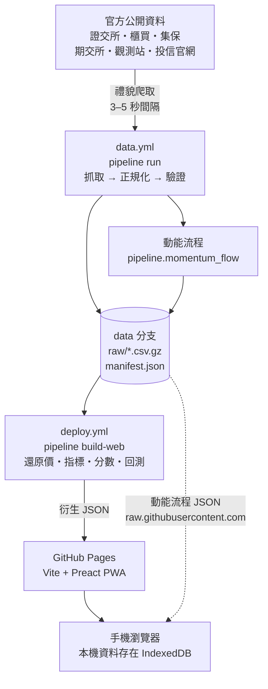

<div align="center">

# 台股資金流向 twse-money-flow

台股盤後**決策輔助** PWA：每天收盤後用官方公開資料算出分數，並附上每個分數的因子明細與依據。

[](https://github.com/zychang39/twse-money-flow/actions/workflows/ci.yml)
[](https://github.com/zychang39/twse-money-flow/actions/workflows/deploy.yml)
[](https://github.com/zychang39/twse-money-flow/actions/workflows/data.yml)


**[開啟 App](https://zychang39.github.io/twse-money-flow/)** · [方法說明](docs/METHODOLOGY.md) · [資料來源](docs/DATA_SOURCES.md) · [決策紀錄](docs/DECISIONS.md)

</div>

> [!IMPORTANT]
> **僅供研究參考，非投資建議。** App 一律以「分數＋依據」呈現，不使用「買進／賣出」字眼，不推薦個股，也不串接券商下單。系統產生的清單都標示「依規則產生，非推薦」。

<p align="center">
  
  
  
  
</p>
<p align="center"><sub>iPhone 393 × 852、深色模式、正式站真實資料（2026-10-08 收盤）</sub></p>

## 目錄

- [功能](#功能)
- [運作方式](#運作方式)
- [快速開始](#快速開始)
- [部署自己的一份](#部署自己的一份)
- [自動排程](#自動排程)
- [專案結構](#專案結構)
- [開發與測試](#開發與測試)
- [資料來源與授權](#資料來源與授權)
- [已知限制](#已知限制)
- [文件](#文件)

## 功能

App 的核心是「每晚 5 分鐘的盤後流程」。底部導覽有 5 個分頁：

| 分頁 | 內容 |
|---|---|
| **簡報** | 一句話結論、加權指數主數字與走勢（1D～ALL）；「總覽｜市場｜資金｜我的」四段：市場環境燈號、法人與資金、持股警示、自選的新變化 |
| **我的股票** | 「自選｜持股」；個股頁有還原／原始價走勢、四環分數（籌碼、動能、基本面、估值）與資料完整度，分成「總覽｜動能｜籌碼｜基本面｜事件」；在頁首左右滑動即可換股 |
| **探索** | 選股（三方同買、營收創新高、近高點放量、低本益高息，可自訂條件）、策略庫、指標效度表、回測、市場溫度、族群輪動、主動式 ETF（持股變動與策略標籤）、行事曆、處置與注意、[動能流程](docs/MOMENTUM_FLOW.md) |
| **搜尋** | 輸入框在螢幕底部、結果由下往上排；可用代號或名稱比對，左滑即加入自選 |
| **流程** | 今日流程（每日與每週步驟）、交易日誌、進場前檢查表、個人統計（以 R 計）、徽章、週報、名詞圖鑑 |

右上角齒輪進入設定、備份、資料健康、資料狀態與方法說明。

**設計原則**

- **手機優先**：以 iPhone 393 × 852 與 375pt 驗收，表格不需要左右滑動，點擊區域至少 44pt。
- **顏色有固定語意**：紅漲綠跌並加 ▲▼；琥珀只代表風險；電光藍只給可互動元素。介面只有深色模式（DECISIONS #304）。
- **無障礙**：文字對比符合 WCAG AA，支援 VoiceOver 與「減少動態效果」。
- **資料只在你的裝置**：自選、日誌、持倉、設定存在瀏覽器 IndexedDB，可匯出成單一 JSON 備份。
- **可離線開啟**：PWA 有 service worker。在 iPhone Safari 選「分享 → 加入主畫面」即可安裝。
- **資料不足時說明原因**：休市、停牌、資料累積中都有對應說明，不留空白圖表。
- **遊戲化只獎勵紀律**：經驗值與徽章只來自完成流程與檢討，不因交易次數或獲利給獎勵，也可以關閉。

## 運作方式



1. **抓取**：每個資料源一個模組，先 `fetch()` 取回原始回應，再 `parse()` 轉成標準欄位。請求間隔 3–5 秒並加隨機延遲，失敗時指數退避，連續失敗就暫停該網站。不繞過任何驗證碼。
2. **正規化與驗證**：民國年轉西元、去千分位、「--」轉空值。日期、筆數、重複列、關鍵欄位任一項驗證失敗就不覆蓋舊資料。
3. **儲存**：原始資料寫進孤兒分支 `data`（`raw/{來源}/{YYYY}/{YYYYMMDD}.csv.gz`），每月 squash 一次。
4. **衍生**：部署時才由 `build-web` 產生還原價、指標、分數、選股、回測等前端 JSON。這些衍生資料不進版控。
5. **前端**：Vite + TypeScript + Preact，使用 hash 路由。設計 tokens 集中在 `web/src/styles/tokens.css`。
6. **失敗處理**：資料源失敗時會自動開一個標籤為 `data-failure` 的 Issue，恢復後自動關閉。每個資料集的狀態可在 App 的「資料健康」頁查看。

## 快速開始

需要 **Python 3.12**、**Node 22** 與 git。

```bash
git clone https://github.com/zychang39/twse-money-flow.git
cd twse-money-flow

# Python 環境
python3.12 -m venv .venv && source .venv/bin/activate
pip install -r pipeline/requirements.txt -r pipeline/requirements-dev.txt

# 用測試樣本產生示範資料，啟動前端
python -m pipeline demo-data --out web/public/data
cd web && npm ci && npm run dev    # http://localhost:5173/twse-money-flow/
```

<details>
<summary>改用真實資料（data 分支）</summary>

```bash
python -m pipeline prepare-data --data-dir data                     # 把 data 分支掛到 ./data
python -m pipeline build-web --data-dir data --out web/public/data  # 產生全部前端 JSON（約 25 分鐘、8 GB 記憶體）
cd web && npm run dev
```

</details>

## 部署自己的一份

1. Fork 這個 repo。
2. **Settings → Pages → Build and deployment → Source** 選「GitHub Actions」。
3. 在 **Actions** 頁啟用 workflows。
4. 執行 **Actions → Data → Run workflow**，task 選 `backfill`，其他欄位留白，預設回補近 3 年。回補會分段執行，每段最多 40 分鐘，並自動接續下一段。
5. 回補完成後，Data 會觸發 **Deploy**。綠勾出現後就能開啟 `https://<你的帳號>.github.io/twse-money-flow/`。

選配的 secrets 與 variables（**Settings → Secrets and variables → Actions**）：

| 名稱 | 類型 | 用途 |
|---|---|---|
| `TELEGRAM_BOT_TOKEN`、`TELEGRAM_CHAT_ID` | Secret | 推播盤後日報與盤中到價提醒；要提醒的股票與價位寫在 `config/alerts.yml`（App「設定 → 盤中到價提醒」可匯出） |
| `ANTHROPIC_API_KEY` | Secret | 部署時產生盤後條列摘要，App 會標示「AI 生成」。沒設定就完全不呼叫 |
| `ANTHROPIC_MODEL` | Variable | 指定摘要用的模型；不設定時使用預設值 |

<details>
<summary>Telegram bot 設定步驟</summary>

1. 在 Telegram 找 **@BotFather**，傳送 `/newbot`，依指示取名後取得 bot token。
2. 對新建立的 bot 傳任意一則訊息。
3. 開啟 `https://api.telegram.org/bot<token>/getUpdates`，`"chat":{"id":…}` 裡的數字就是 chat id。
4. 把兩個值分別存成 `TELEGRAM_BOT_TOKEN` 與 `TELEGRAM_CHAT_ID`。

</details>

> [!NOTE]
> 動能流程的前端直接讀 data 分支的 `raw.githubusercontent.com` 網址。Fork 後要把 `web/src/momentum/data.ts` 的 `MOMENTUM_BASE` 改成自己的 repo。

## 自動排程

`.github/workflows/data.yml`，以下都是台北時間：

| 時間 | 任務 |
|---|---|
| 交易日 08:05、10:05、12:05 | 補抓起跑點：補前一交易日的缺漏，並預約當天的接力 |
| 交易日 15:02 → 16:02 → 17:02 → 22:02 | 接力補抓，依序取得：收盤行情與指數 → 三大法人、本益比 → 外資持股、注意／處置名單 → 融資融券、借券、當沖。有新資料時會重算動能流程並部署；三大法人補齊那次部署後推播 Telegram 日報 |
| 交易日 15:15、16:30、22:30 | 備援排程，在接力沒接上時補位 |
| 交易日 14:45 | 個股 5 分 K（Yahoo，非官方），跑不完會自動接續 |
| 交易日 09:00–13:45，每 15 分鐘 | 盤中到價提醒，只讀即時報價、不寫資料 |
| 交易日 22:40 | 接續白天延後的回補分段 |
| 每週六 10:00 | 集保股權分散表、央行 M1B／M2、法說會 |
| 每月 11 日 | 月營收 |
| 4/1、5/16、8/16、11/16 | 年報與季報（法定期限後） |

GitHub 的排程常會延遲數小時，所以每次補抓結束時都會以 `workflow_dispatch` 預約下一次（接力）。每次執行也會呼叫 API，避免排程因 60 天沒有活動而被停用。各資料集的預期公布時間設定在 `config/schedule.yml`。

## 專案結構

```text
.
├── pipeline/              Python 3.12，python -m pipeline <command>
│   ├── core/              禮貌爬取 HTTP、交易日曆、正規化、儲存、驗證、manifest
│   ├── sources/           每個資料源一個模組：fetch() → parse()
│   ├── derive/            還原價、指標、分數、選股、回測、前端 JSON
│   ├── evidence/          指標效度評估（事件研究、隨機對照）
│   ├── momentum_flow/     動能流程（獨立模組）
│   └── notify/            Telegram、GitHub Issue
├── web/                   Vite + TypeScript + Preact PWA
│   ├── src/pages/         頁面
│   ├── src/lib/           純函式（有單元測試）
│   ├── src/momentum/      動能流程頁面（獨立模組）
│   ├── src/styles/        設計 tokens 與樣式
│   └── e2e/               Playwright 測試
├── config/                單一事實來源：權重、門檻、交易成本、資料源、產業、介面參數
├── tests/                 pytest；fixtures/raw 為真實樣本，golden 為 pytest 與 vitest 共用的比對檔
├── docs/                  方法、資料源、決策、設計文件
└── .github/workflows/     ci、data、deploy、smoke-test、capture-fixtures
```

## 開發與測試

送 PR 前在本機跑與 CI 相同的檢查：

```bash
# Python
ruff check pipeline tests && ruff format --check pipeline tests
mypy pipeline
pytest -q

# 前端（在 web/）
npm run lint && npm run typecheck && npm test && npm run build
npm run e2e                  # Playwright 冒煙測試（需先 build）
python3 scripts/contrast.py  # 設計 tokens 的 WCAG AA 對比
```

常用 pipeline 指令：

| 指令 | 用途 |
|---|---|
| `python -m pipeline daily --data-dir data` | 每日任務 |
| `python -m pipeline backfill --data-dir data --source twse_quotes --start 2023-10-01` | 回補指定來源與區間 |
| `python -m pipeline build-web --data-dir data --out web/public/data` | 產生前端 JSON |
| `python -m pipeline demo-data --out web/public/data` | 用測試樣本產生示範資料 |
| `python -m pipeline smoke --date 2026-09-24` | 資料源冒煙測試：檢查各來源的必要欄位 |
| `python -m pipeline.momentum_flow update --data-dir data` | 動能流程：快照、前端 JSON、回測 |

開發守則（依賴版本鎖定、不放密鑰、新資料源先抓真實樣本、決策寫進 `docs/DECISIONS.md`）見 [CLAUDE.md](CLAUDE.md)。iPhone 真機的手動驗收見 [docs/QA_CHECKLIST.md](docs/QA_CHECKLIST.md)。

## 資料來源與授權

| 來源 | 資料 |
|---|---|
| 臺灣證券交易所、證券櫃檯買賣中心 | 行情、指數、三大法人、融資融券、借券、當沖、本益比、注意／處置、除權息 |
| 臺灣集中保管結算所 | 集保股權分散表 |
| 臺灣期貨交易所 | 期貨法人、未平倉 |
| 公開資訊觀測站 | 月營收、季財報、法說會 |
| 中央銀行、美國財政部 | M1B／M2、美債殖利率 |
| 各發行投信官網 | 主動式 ETF 每日持股（公開揭露） |
| Yahoo Finance（非官方） | 個股 5 分 K，只用於個股頁 1D／1W |

政府資料依「[政府資料開放授權條款－第 1 版](https://data.gov.tw/license)」及各網站使用規範使用，App 頁尾標示來源。每個端點、實測結果與狀態見 [docs/DATA_SOURCES.md](docs/DATA_SOURCES.md)。

本 repo 目前沒有附開源授權條款（LICENSE），程式碼保留所有權利。

## 已知限制

- **主動式 ETF 持股**：只在各投信官網個別揭露，沒有集中來源。目前實作 14 家投信、涵蓋 30／32 檔（國泰、兆豐會擋本工具），每日實際涵蓋數顯示在頁首。
- **分點券商進出**：官方查詢需要驗證碼，依規則不實作。券商研究報告與目標價沒有官方免費來源，只提供標示「第三方」的連結。
- **月營收公布日**：歷史資料取不到實際公布日，保守假設次月 10 日生效。
- **估算值**：法人成本線、合理價、櫃買面額變更（以價格跳空推估）都是估算，App 上有標示。
- **動能流程**：注意名單自 2023-06 起才有資料，回測從 2023-10 開始；族群用的是目前的產業分類，沒有歷史分類。
- **雲端 IP 封鎖**：證交所會封鎖部分雲端 IP。Actions 被擋時，該來源會標示失敗並開 Issue，其他來源不受影響。

完整清單與每個來源的狀態見 [docs/DATA_SOURCES.md](docs/DATA_SOURCES.md)。

## 文件

| 文件 | 內容 |
|---|---|
| [docs/METHODOLOGY.md](docs/METHODOLOGY.md) | 指標、分數、回測、推播的計算定義 |
| [docs/DATA_SOURCES.md](docs/DATA_SOURCES.md) | 資料來源、端點、實測結果與狀態 |
| [docs/DECISIONS.md](docs/DECISIONS.md) | 開發過程中的決策紀錄 |
| [docs/MOMENTUM_FLOW.md](docs/MOMENTUM_FLOW.md) | 動能流程的公式、每日更新時間表、資料不足範圍 |
| [docs/INDICATOR_EVIDENCE.md](docs/INDICATOR_EVIDENCE.md) | 指標效度評估 |
| [docs/UI_GUIDE.md](docs/UI_GUIDE.md) | 介面規範 |
| [docs/design/](docs/design/README.md) | 設計方向、資訊架構、驗收截圖 |
| [docs/QA_CHECKLIST.md](docs/QA_CHECKLIST.md) | iPhone 真機手動驗收清單 |
| [docs/BACKLOG.md](docs/BACKLOG.md) | 待辦與產品原則 |
| [CLAUDE.md](CLAUDE.md) | 架構與開發守則 |
