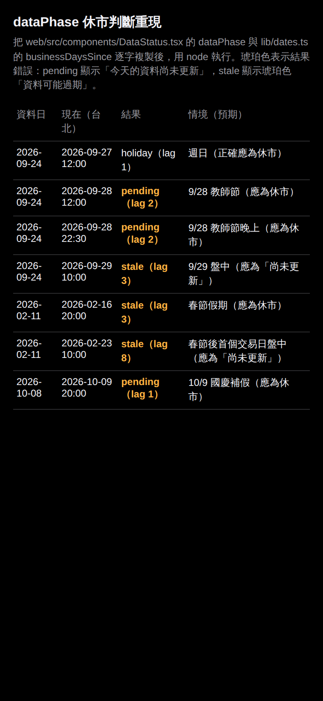
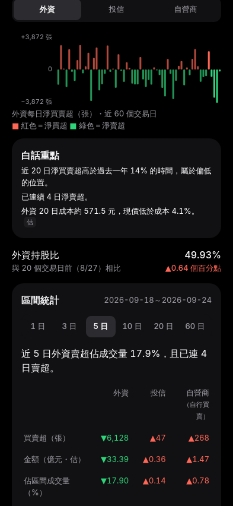
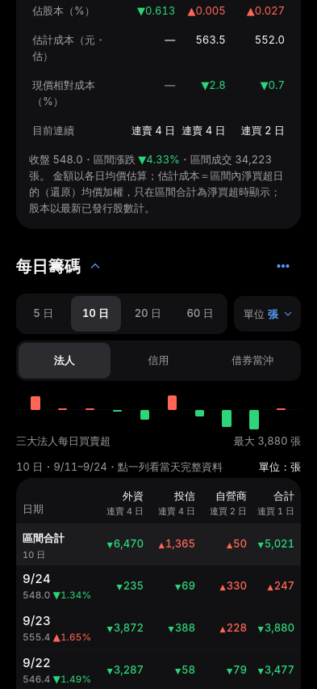

# 健檢待辦清單（2026-09-28 唯讀健檢）

本報告是一次唯讀健檢，**沒有修改任何程式碼**。

- **檢查基準**
  - 程式：main `4de32b6`（PR #8 合併後）
  - 資料：data 分支 `9bdca66`（2026-09-28 21:05 更新）
- **資料日期**：最新交易日是 2026-09-24。9/25 中秋節、9/28 教師節都休市，已用 `raw/twse_holidays/2026` 確認。
- **欄位說明**
  - 類別：錯誤、資料正確性、體驗、效能、程式品質
  - 嚴重度：高、中、低
  - 工作量：S 約半天以內，M 約 1–3 天，L 超過 3 天
  - 證據：`檔案:行號`、截圖（`docs/audit/`），或重現步驟
- **標記說明**
  - 「已驗證」：讀過程式碼後，再用 data 分支的真實資料或最小重現腳本確認過。
  - 「推測」：只從程式碼推論，沒有實際執行。

## 建議優先處理的前 10 項

排序方式：影響大、工作量小的排前面。計分為嚴重度（高 3、中 2、低 1）除以工作量（S 1、M 2、L 3），同分時依對使用者的影響排序。

| # | ID | 項目 | 類別 | 嚴重度 | 工作量 |
|---|---|---|---|---|---|
| 1 | E-01 | 18 檔個股 JSON 含 `NaN`，瀏覽器無法解析，個股頁顯示「找不到資料」 | 錯誤 | 高 | S |
| 2 | E-02 | 平日休市被判成「尚未更新」；9/29 上午會出現琥珀色「資料可能過期」的假警示 | 錯誤 | 高 | S |
| 3 | E-03 | 權益曲線漏算在休市日或週末建倉、平倉的交易 | 錯誤 | 中 | S |
| 4 | U-01 | 下市或長期停牌的持股，在「持股」分段直接消失，沒有任何提示 | 體驗 | 中 | S |
| 5 | U-02 | 當日無成交或停牌時，把舊的漲跌幅顯示成「今日」，還說是資料問題 | 體驗 | 中 | S |
| 6 | D-03 | 期交所法人資料 2023-09～2024-06 整段缺漏（微台 TMF 查詢失敗，連帶丟掉 TXF、MXF） | 資料正確性 | 中 | S |
| 7 | D-04 | 「查無資料」或 0 筆的回應被記成 ok（mops_revenue、taifex） | 資料正確性 | 中 | S |
| 8 | Q-01 | CI 不跑 push 到 main 的提交，部署前沒有測試把關 | 程式品質 | 中 | S |
| 9 | D-01 | 分割、減資後，日誌與持股的損益和停損仍用原始價，0050 分割會造成假的「觸及停損」 | 資料正確性 | 高 | M |
| 10 | D-02 | 16 個解析器沒有用 `frame_from_fields`，格式變動時會中斷每日任務，或被記成「沒資料」 | 資料正確性 | 高 | M |

接下來建議處理：
- E-04：匯入壞檔可能清空資料
- E-05：Data workflow 排程可能被長時間回補擠掉，9/29 要確認
- U-03：點擊區域小於 44pt
- Q-05：文件過時

---

## 一、檢查範圍與這次無法完成的部分

| 範圍 | 做了什麼 | 限制 |
|---|---|---|
| 1. 資料正確性 | 抽查 2330、2317、2454、8299 群聯（上櫃）、0050 與 00878（ETF），最近 5 個交易日的收盤、開高低量、三大法人、融資融券，以及 2026-08 月營收，和證交所、櫃買中心的官方 API 與 `tests/fixtures` 比對，共 34 次官方請求，間隔 4–7 秒。完整比對表見 [`docs/audit/data-comparison.md`](audit/data-comparison.md)。另外依 manifest 推演資料健康頁會顯示的內容。 | 上市法人 9/23 那天，證交所 WAF 連續 3 次擋下請求（HTTP 307），所以沒有比對到。 |
| 2. 錯誤與邊界 | 休市日、資料缺漏、新股、下市股、ETF、零資料自選、壞檔匯入。追完整條路徑（pipeline → JSON → 前端），並用 stdlib 或 node 重現純函式。 | 無法執行 pytest 和 vitest（見下方說明）。 |
| 3. 行動體驗 | 檢視 repo 內最新的 iPhone 393pt 深色截圖（`docs/design/v3`、`round4`、`ux-fixes/after/browser-dark`），並用 Chromium 裁成手機畫面大小逐段檢查；另以 CSS 靜態檢查點擊區域。 | **沒辦法產生新的 Playwright 截圖**（見下方說明）。 |
| 4. 效能 | 從最新一次 Deploy workflow 的 log（run 36433548431）取得實際的 chunk 大小、`summary_gzip_bytes` 與個股檔數量。 | **沒有跑 Lighthouse**。 |
| 5. 程式品質 | 重複程式碼、關鍵計算與測試的對照、過時文件、原則遵循，全部是靜態分析。 | 無法執行 ruff、mypy、eslint、tsc。 |
| 6. GitHub Issues | 讀取 repo 所有 open issues。 | **目前 open issue 共 0 個**，沒有需要併入的項目。 |

**為什麼有些檢查做不到：** 這個雲端環境的網路政策擋掉了以下網址（proxy 回 403）：
- `registry.npmjs.org`、`pypi.org`、`files.pythonhosted.org`
- jsDelivr、unpkg
- Ubuntu apt
- `zychang39.github.io`
- Actions artifact 所在的 Azure blob

因此沒辦法 `npm ci`、`pip install`，也沒辦法 build 前端或打開正式站。能連線的只有證交所、櫃買、期交所、MOPS 與 GitHub API。

**要補做的話：**
1. 在雲端環境設定（標題列的環境選單 → Edit → Network access）加入上述網址；或改在本機執行。
2. 用 `web/scripts/ux-shots.mjs` 重拍截圖。這支腳本已是 393×852、深色，但目前只涵蓋 `#/`、`#/mine`、`#/search`、`#/stock/2330`、`#/me/health`，需要加上 `#/explore` 與 `#/discipline`。
3. 用 Lighthouse 12 行動版量測今晚、我的股票、個股頁（見 P-02）。

## 二、資料正確性抽查結果

**結論：** 沒有發現錯值。

逐值比對 413 項：
- 408 項完全相符。
- 4 項只差在官方個股月報以「張」四捨五入。
- 1 項不符但原因未證實：8299 在 9/18 的成交量，見 D-11。

| 項目 | 範圍 | 結果 |
|---|---|---|
| 收盤、開高低、成交股數 | 6 檔 × 5 天 | 全部相符 |
| 三大法人（外資、投信、自營商、合計） | 6 檔 × 4–5 天 | 全部相符 |
| 融資、融券餘額 | 6 檔 × 5 天 | 全部相符。0050 在 9/21 融資從 33,477 張跳到 72,773 張，官方也是如此。 |
| 2026-08 月營收 | 2330、2317、2454、8299、5347、6488 | 全部相符。官方 1,978 筆全部都在 data 分支中。 |
| ETF 月營收 | 0050、00878 | 本來就沒有；分數會把缺值類別排除後重新加權（`pipeline/derive/scores.py:72-73`）。 |
| 重複與日期一致性 | 3,600 個日檔 | 沒有重複代號，檔內日期都和檔名一致。 |
| 交易日覆蓋 | quotes、insti、margin、valuation | 從最早的檔案到 9/24，只缺 6 天，全部是 manifest 的 `closed_days`（颱風臨時休市）。 |

**資料健康頁**

依目前的 manifest 推演，頁首不會顯示「資料源異常」，但有三個地方會誤導使用者：
- 結論寫「1 個來源使用相容模式」（tpex_valuation）。這是回補 2024 年舊格式留下的警告，不是現在的格式有變，見 Q-08。
- `tdcc_history`、`active_etf` 顯示「尚未抓取」。
- 行事曆頁的來源 id 寫錯，所以永遠不會提示異常，見 Q-08。

休市日不會讓健康頁誤判落後天數：它只算 `twse_quotes` 實際有檔案的日期。但頁首的資料狀態列（`DataStatus`）會出錯，見 E-02。

## 三、待辦項目

### 錯誤

#### E-01　18 檔個股 JSON 含 `NaN`，個股頁打不開
- 類別：錯誤｜嚴重度：高｜工作量：S｜已驗證
- 證據：
  - `pipeline/core/store.py:139` 讀 CSV 時 `keep_default_na=True`，空字串會變成 NaN。
  - `pipeline/derive/build.py:269` 的 `short_halt_for` 把 `reason` 原樣放進 dict。
  - `pipeline/derive/build.py:206`（`**extra`）把這個 dict 直接展開，沒有經過 `clean()`。
  - `pipeline/derive/export.py:58` 的 `json.dumps` 沒有設 `allow_nan=False`，NaN 會寫成字面上的 `NaN`。
  - 真實資料 `raw/tpex_short_halt/2026/20260924.csv.gz` 共 18 列（00950B、00959B、00966B 等上櫃債券 ETF），`reason` 欄全部空白。
  - 結果：`web/src/data/api.ts:15` 的 `res.json()` 解析失敗，個股頁顯示錯誤。
  - 現有測試 `tests/pipeline/test_export.py` 用 Python 的 `json.loads` 驗證，它接受 NaN，所以測不出來。
- 建議修法：
  - `write_json` 前先遞迴套用 `clean()`，並改用 `allow_nan=False`，讓問題在 build 時就失敗。
  - 測試改用 `json.loads(..., parse_constant=拋錯)`。

#### E-02　休市狀態只看星期幾：平日休市顯示「尚未更新」，隔天出現「資料可能過期」的假警示
- 類別：錯誤｜嚴重度：高｜工作量：S｜已驗證
- 證據：
  - `web/src/components/DataStatus.tsx:20-30` 的 `dataPhase` 與 `web/src/lib/dates.ts:7-19` 的 `businessDaysSince` 只排除週末，不看國定假日。
  - 用 node 重現的結果見 ：

    | 情境 | 顯示 |
    |---|---|
    | 9/28 教師節 | 「今天的資料尚未更新」 |
    | **9/29 上午** | 琥珀色「資料可能過期，落後 3 個工作日」 |
    | 春節期間 | 整段「資料可能過期」 |
    | 春節後第一個交易日上午 | 落後 8 個工作日 |

  - 真實畫面：`docs/audit/01-stock-holiday-status.png` 是 9/28 截的個股頁，顯示「今天的資料尚未更新」。
  - 這也違反「琥珀只代表風險」的原則，而且沒有任何測試。
- 建議修法：
  - `meta.json` 輸出交易日曆（`twse_holidays` 加上 `closed_days`，或直接用 `index.json` 的交易日）。
  - `dataPhase` 改用交易日計算落後天數。
  - 補上 9/28、9/29、春節三組測試。

#### E-03　權益曲線漏算在休市日或週末建倉、平倉的交易
- 類別：錯誤｜嚴重度：中｜工作量：S｜已驗證（node 重現）
- 證據：
  - `web/src/lib/portfolio.ts:27,40` 要求 `openedAt`、`closedAt` 與某個交易日完全相同。
  - 但 `web/src/components/Trades.tsx:90` 的建倉日預設是 `todayTpe()`，`:150,157` 的平倉日預設也是今天。
  - 在 9/28 建倉的交易，權益一直停在 1,000,000，整筆被忽略；週六平倉的交易永遠不會實現。
- 建議修法：建倉與平倉日期對齊到「該日（含）之後的第一個交易日」，並補測試。

#### E-04　匯入格式錯誤的備份可能清空部分資料
- 類別：錯誤｜嚴重度：中｜工作量：S｜推測（依 IndexedDB 規格推論，沒有執行）
- 證據：
  - `web/src/db/backup.ts:32-58` 沒有驗證結構，出錯時也沒有 `tx.abort()`。
  - 例如 `{"app":"twse-money-flow","schemaVersion":3}`：`clear()` 完成後才因為讀不到 `stores[name]` 丟出例外，交易仍可能自動提交，自選就被清空。
  - `schemaVersion` 缺少時，遷移迴圈會用 NaN 執行並直接跳過。
  - 預設是「取代全部」，而且沒有確認步驟（`web/src/pages/Backup.tsx:17,28-37`）。
- 建議修法：
  - 先完整驗證：`schemaVersion` 是整數、每個 store 都是陣列、每列都有主鍵。
  - 出錯時 `tx.abort()`；取代前加上確認對話框。
  - 補壞檔測試。

#### E-05　Data workflow 的排程任務可能被長時間回補擠掉
- 類別：錯誤｜嚴重度：中｜工作量：S｜部分未證實
- 證據：
  - `.github/workflows/data.yml:44-46` 設定 `concurrency: data-pipeline`、`cancel-in-progress: false`。GitHub 在同一群組只保留最新一個等待中的 run。
  - 10 年回補（run #6，2026-09-28 13:22Z 開始，最長約 350 分鐘並會自動接續）執行期間，排程觸發的每日任務或盤中提醒可能被取消。
  - data.yml 總共只有 6 次執行紀錄，其中只有 1 次來自排程。
  - 9/28 休市，所以這次沒有實際損失。
- 建議修法：
  - **9/29 收盤後確認每日任務有執行。**
  - 回補改用不同的 concurrency group，或讓回補在每日排程前主動讓出。

#### E-06　Telegram 日報在平日休市重送前一個交易日的內容
- 類別：錯誤｜嚴重度：低｜工作量：S｜已驗證
- 證據：
  - `pipeline/cli.py:105` 只看 `is_final_run`；`data.yml` 的排程是週一到週五。
  - `pipeline/notify/telegram.py:130-137` 沒有依日期去重。
  - 結果：9/25、9/28 會再送一次 9/24 的日報。
- 建議修法：summary 日期不等於目標交易日，或已經送過時就跳過。

#### E-07　期交所回補的查詢迄日超過最新資料日時失敗
- 類別：錯誤｜嚴重度：低｜工作量：S｜已驗證
- 證據：
  - manifest 裡的 `taifex_insti 2026-09-25` 失敗就是這個原因。
  - 期交所對「迄日為今天、但今天還沒有資料」的查詢回傳 `alert("… DateTime error")`。
  - 迄日預設是今天（`pipeline/cli.py:75`），`run_taifex` 直接拿來用。
- 建議修法：迄日夾到 `latest_on_or_before(min(end, today))`。

#### E-08　小寫代號的網址 404，而且還能加入自選
- 類別：錯誤｜嚴重度：低｜工作量：S｜已驗證
- 證據：`#/stock/00980a` 會 404（`web/src/app.tsx:47` 沒有轉大寫），但仍可以把小寫代號加進自選。
- 建議修法：路由與自選寫入時一律轉成大寫。

#### E-09　證交所 WAF 阻擋可能被誤判為「格式變動」
- 類別：錯誤｜嚴重度：低｜工作量：S｜未證實
- 證據：
  - 稽核時以 4–6 秒間隔請求，第 8 次開始收到 HTTP 307「FOR SECURITY REASONS」。
  - `pipeline/core/http.py:85` 會跟隨轉址（`allow_redirects=True`），推測拿到的是 HTML，解析時報「不是 JSON」。
  - `web/src/lib/health.ts` 的 `FORMAT_RE` 會把這類錯誤顯示成「證交所調整了資料格式」。
  - 目前 manifest 裡沒有這類失敗。
- 建議修法：遇到 307 或「FOR SECURITY REASONS」時當成封鎖錯誤處理，並觸發退避與斷路器。

### 資料正確性

#### D-01　分割、減資後，日誌與持股的損益和停損用原始價
- 類別：資料正確性｜嚴重度：高｜工作量：M｜已驗證（程式碼）
- 證據：
  - `web/src/pages/Journal.tsx:64-66` 與 `web/src/lib/holdings.ts:15-17` 用原始收盤比進場價，計算損益並判斷是否觸及停損。
  - `web/src/lib/changes.ts:40` 的快照存原始收盤。
  - `web/src/pages/Stats.tsx:34-35` 與 `web/src/lib/portfolio.ts:33-37` 的權益曲線只處理股利，沒有處理分割。
  - data 分支裡的真實事件：0050 在 2025-06-18 分割（因子 0.25）、00631L 在 2026-03-31（因子 0.045）、00685L 在 2026-07-07。
  - 結果：持有這些 ETF 的人會看到約 −75% 的損益與假的「觸及停損」，除息日也會出現「自上次跌 X%」。
- 建議修法：用進場日到今天的還原因子比值，換算進場價、停損價與股數；或一律用還原價比較。

#### D-02　16 個解析器沒有用 `frame_from_fields`（違反 CLAUDE.md 開發守則）
- 類別：資料正確性｜嚴重度：高｜工作量：M｜已驗證（程式碼）
- 證據：
  - `pipeline/sources/advanced.py:397-423` 的 `parse_taifex_insti`：表頭少了「身份別」就回 `no_data`，少其他欄位就丟出 KeyError。
  - `advanced.py:429`（taifex_oi）用 `h.index`，欄位不見會丟 ValueError；`:455`（匯率）用 `next()`，找不到會丟 StopIteration。
  - `pipeline/tasks_advanced.py:44-51` 沒有檢查 `res.no_data`，一律記成 ok、0 列。
  - `pipeline/tasks.py` 只攔 `(FetchError, ParseError)`，上面那些例外會中斷整個每日任務。
  - 同樣的情況也出現在 optional、mops、etf_holdings 的解析器。
- 建議修法：
  - 全部改用 `expect_fields`／`frame_from_fields`，欄位缺少時丟 `ParseError`。
  - 空結果記為失敗。
  - 每個解析器補一個「欄位缺少」的測試。

#### D-03　期交所法人資料 2023-09～2024-06 整段缺漏
- 類別：資料正確性｜嚴重度：中｜工作量：S｜已驗證（官方重現）
- 證據：
  - `config/sources.yml:370` 的 commodities 設定為 `[TXF, MXF, TMF]`，但微台 TMF 在 2024-07 才上市。查詢更早的月份時，期交所回傳 HTML，解析器丟出 ParseError。
  - `pipeline/tasks_advanced.py:43-52` 把三個商品放在同一個 try 裡，TMF 一失敗，同月已經抓到的 TXF、MXF 也一起丟掉。
  - 結果：`raw/taifex_insti` 從 20240701 才開始。
  - 重現：`curl --data "queryStartDate=2024%2F06%2F01&queryEndDate=2024%2F06%2F30&commodityId=TMF" https://www.taifex.com.tw/cht/3/futContractsDateDown` 回傳 HTML；同一查詢把 `commodityId` 改成 `TXF` 就回傳正常的 CSV。
  - 補充：manifest 裡「2024-06-30 等月底日期失敗」看起來像是請求了非交易日，其實不是。那只是記錄用的查詢迄日，失敗的真正原因是上面的 TMF。
- 建議修法：
  - 每個商品各自 try；或在設定中加上各商品的上市日。
  - 修好後重跑 2023-09～2024-06 的回補。

#### D-04　「查無資料」或 0 筆的回應被記成 ok
- 類別：資料正確性｜嚴重度：中｜工作量：S｜已驗證
- 證據：
  - `mops_revenue` 在 manifest 裡是 `rows: 0`、`last_success: 2026-09-01`。
  - 原因：回補的月份清單包含當月（`pipeline/tasks.py:384,489`）。MOPS 對還沒公布的月份回傳「查無資料」頁，但標題仍在，所以解析器（`pipeline/sources/mops.py:28-66`）回傳 0 筆，`run_mops_revenue`（`tasks.py:297`）照樣記成 ok。
  - 結果：健康頁會以為已經有 9 月營收。
  - 重現：`curl https://mopsov.twse.com.tw/nas/t21/sii/t21sc03_115_9_0.html` 會看到「查無資料」。
- 建議修法：
  - 「查無資料」回傳 no_data；0 筆不記成 ok。
  - 回補時略過還沒到公布期限的月份。

#### D-05　無成交日讓指標整段變成 NaN，分數跟著跳動
- 類別：資料正確性｜嚴重度：中｜工作量：M｜已驗證（程式碼＋真實資料統計）
- 證據：
  - `pipeline/derive/build.py:52-53` 的還原價沒有補值；`pipeline/derive/indicators.py:107-108` 用 `rolling(n, min_periods=n)`，窗內只要缺一天就是 NaN。
  - 最近 240 個交易日中，1,851 檔普通股有 311 檔至少一天無收盤，另有 40 檔缺列。這些股票的 `ma240_gap` 最多會有整整 240 天是 NaN。
  - 9/24 當天有 24 檔無收盤，動能類別整類缺值；`pipeline/derive/scores.py:98-103` 重新加權後，綜合分會跳動。
  - 前端均線（`web/src/lib/fundamentals.ts:40`）只用有收盤的日子計算，和選股、分數的結果不一致。
- 建議修法：
  - 指標改在每檔去除空值後的序列上計算，再展開回日期。
  - 當日無成交時沿用前一日的分數。

#### D-06　回補尚未完成：籌碼類缺 145 個交易日，正式站還沒有 5Y／10Y 股價
- 類別：資料正確性｜嚴重度：中｜工作量：M（主要是執行時間）｜已驗證
- 證據：
  - data 分支的行情、法人、信用、估值都從 2024-04-11 開始；3 年預設的起點是 2023-09-01，還差 145 個交易日（manifest 的 run `2026-09-27T10:12` 顯示 `remaining 145`，之後沒有接續）。
  - 最新 Deploy log：`dates: 600`、`long_history.files: 0`。所以正式站選 5Y／10Y 時只會顯示「資料累積中」。
  - `docs/V3_NOTES.md` M5 與 `docs/DATA_SOURCES.md` 描述的 10 年股價，要等 [Data run #6](https://github.com/zychang39/twse-money-flow/actions/runs/36428099609) 完成。這個 run 在開發分支上執行，不會部署。
- 建議修法：
  - run #6 完成後，從 main 觸發一次 Deploy。
  - 對籌碼類來源補跑 `backfill --start 2023-09-01 --end 2024-04-10`。
  - 把實測的檔案大小更新到 DATA_SOURCES.md。

#### D-07　8 月營收沒有進入 9/24 的分數
- 類別：資料正確性｜嚴重度：低｜工作量：S｜已驗證
- 證據：
  - `pipeline/derive/metrics.py:37-43`：有 `first_seen` 就直接用它當生效日。
  - 8 月營收的 `first_seen` 全部是 2026-09-27，因為 pipeline 那天才開始運作。但官方出表日是 9/17，法定期限是 9/10。
  - 歷史月份沒有 `first_seen`，會用次月 10 日，不受影響。
  - 這是一次性的問題：9/29 起就會改用 8 月營收。但只要日後排程中斷，同樣的情況會再發生。
- 建議修法：生效日改為 `min(first_seen, 次月 revenue_fallback_day 日)`。

#### D-08　法人資料缺漏時，資金流顯示「0 億」
- 類別：資料正確性｜嚴重度：低｜工作量：S｜已驗證
- 證據：`pipeline/derive/extras.py:206-209,420-428` 對全部是 NaN 的資料做 `sum()`，結果是 0。
- 建議修法：改用 `sum(min_count=1)`，缺資料時輸出 None，畫面顯示「—」。

#### D-09　市場漲跌家數用原始收盤差，除息日會被算成下跌
- 類別：資料正確性｜嚴重度：低｜工作量：S｜已驗證
- 證據：`pipeline/derive/extras.py:429,433`；產業輪動用的是還原價，兩邊不一致。
- 建議修法：改用 `p.change`（官方漲跌）或還原價。

#### D-10　回測的「下市」誤判，債券 ETF 證交稅高估，資料邊界外的樣本沒有列入排除統計
- 類別：資料正確性｜嚴重度：低｜工作量：S｜已驗證
- 證據：
  - `pipeline/derive/backtest.py:112-122`：出場日之後到資料結尾都無成交，就被標成「下市」。
  - `config/costs.yml` 的 ETF 證交稅 0.1% 也套用在 B 結尾的債券 ETF，但債券 ETF 證交稅目前停徵中。
  - `backtest.py:110` 與 `web/src/lib/backtest.ts` 的對應段落：持有期超出資料範圍時直接略過，不計入 `excluded`，所以衰減曲線的樣本數和統計對不上。
- 建議修法：
  - 下市判定改成「之後再也沒有出現在行情中」。
  - costs.yml 為債券 ETF 另設稅率。
  - 邊界外的樣本計入 `excluded["no_future"]`。

#### D-11　8299 在 9/18 的成交量和個股月報差 27,309 股、1 筆
- 類別：資料正確性｜嚴重度：低｜工作量：S｜原因未證實
- 證據：data 分支是 6,695,309 股／22,735 筆，櫃買個股月報是 6,668 張／22,734 筆。9/24 則和 dailyQuotes fixture 完全相同。推測兩份報表的統計範圍不同（例如是否含鉅額交易）。
- 建議修法：在 METHODOLOGY 註明成交量採用 dailyQuotes 的定義。

#### D-12　大多數法人日檔缺少自營商的買進、賣出股數
- 類別：資料正確性｜嚴重度：低｜工作量：M｜已知
- 證據：600 個日檔中有 536 個缺少 dealer 與 foreign_dealer 的買賣欄，只有 2026-06-26 之後才有。UI 已顯示「資料回補中」（V3_NOTES M0-1）。
- 建議修法：用 `backfill --refresh` 分段補齊，完成後移除註記。

### 體驗

#### U-01　下市或長期停牌的持股，在「持股」分段無聲消失
- 類別：體驗｜嚴重度：中｜工作量：S｜已驗證
- 證據：
  - `pipeline/derive/build.py:291` 只輸出近 20 日有交易的股票。真實資料有 12 檔被濾掉，例如 1589 永冠-KY、3454 晶睿、00883B。
  - `web/src/pages/Mine.tsx:229,253` 的「無資料（可能已下市）」卡只在自選分段顯示；`web/src/lib/holdings.ts:12-15` 在沒有資料時也沒有提醒。
  - 結果：持股數寫 N，實際只列出 N−1 列。
  - 個股頁 404 時，市場標籤仍寫「上市」（`web/src/pages/Stock.tsx:120`），錯誤訊息直接露出「HTTP 404」。
- 建議修法：
  - 持股分段也顯示缺資料卡。
  - pipeline 為停牌、下市的股票輸出最小資料（名稱、最後交易日、狀態）。
  - 404 改用友善的文字。

#### U-02　當日無成交或停牌時，把舊漲跌幅當成「今日」
- 類別：體驗｜嚴重度：中｜工作量：S｜已驗證
- 證據：
  - `pipeline/derive/build.py:136-150` 取 `last_valid_index`，但 summary 沒有記錄這個值是哪一天的。
  - `web/src/lib/changes.ts:40` 顯示「今日漲 X%」。
  - 個股頁的 `DataStatus date=h.d[-1]`（`web/src/pages/Stock.tsx:347`）會顯示「尚未更新」或「資料可能過期」，把停牌說成資料問題。
- 建議修法：summary 加上 `last_trade_date`，UI 改寫成「今日無成交／停牌中」。

#### U-03　多處點擊區域小於專案自訂的 44pt
- 類別：體驗｜嚴重度：中｜工作量：S｜已驗證（CSS）
- 證據：`web/src/styles/tokens.css:41` 定義了 `--tap: 2.75rem`（44pt），但以下元件都比這小：

  | 元件 | 位置 | 最小高度 |
  |---|---|---|
  | `.segmented button`（每日籌碼的法人／信用分段、自選／持股） | `web/src/styles/global.css:238` | 36px |
  | `.chip`（群組篩選） | `global.css:248` | 36px |
  | `.btn.small` | `global.css:212` | 36px |
  | `.sort-select`（依變化排序） | `global.css:225` | 36px |
  | `.range-seg button`（還原價／原始價） | `global.css:806` | **32px** |

  期間按鈕 `.periods` 有正確使用 `--tap`。截圖 `docs/design/v3/stock-swing-dark.png` 的「還原價／原始價」切換明顯偏小。
- 建議修法：這些元件的 `min-height` 改用 `var(--tap)`；視覺上要維持小尺寸的，用 `::before` 擴大可點擊範圍。

#### U-04　每日籌碼與區間統計的表頭斷成 2–3 行
- 類別：體驗｜嚴重度：低｜工作量：S｜已驗證（截圖）
- 證據：
  - ：「自營商（自行買賣）」斷成「（自行買」／「賣）」三行；「佔區間成交量（%）」斷行。
  - ：「估計成本（元・估）」「現價相對成本（%）」的單位被擠到下一行。
- 建議修法：單位移到表頭下方的小字或表格說明；括號前加上不斷行設定；用 375pt 與 393pt 的 e2e 測試確認不斷行。

#### U-05　清單列的變化理由被截斷，關鍵數字看不到
- 類別：體驗｜嚴重度：低｜工作量：S｜已驗證（截圖）
- 證據：`docs/design/ux-fixes/after/browser-dark/02-mine.jpg` 與 `docs/design/walkthrough/07-rings.jpg`：「外資＋投信淨賣 4.5 萬 張（量的 …」「6505・新風險旗標…」，理由的後半段看不到。
- 建議修法：理由改成兩行（`-webkit-line-clamp: 2`），或把最關鍵的數字移到最前面。

#### U-06　探索頁雙欄卡片的中文斷在詞中間
- 類別：體驗｜嚴重度：低｜工作量：S｜已驗證（截圖）
- 證據：`docs/design/round4/dark-03-dock-explore.jpg`：「3 項風」／「險」、「1 項中」／「性」。
- 建議修法：用 `word-break: keep-all` 或在「・」處斷行；卡片改成一句較短的摘要。

#### U-07　空白文字欄位在畫面上顯示成「nan」
- 類別：體驗｜嚴重度：低｜工作量：S｜已驗證
- 證據：`pipeline/derive/stockdetail.py:66` 的 `str(kind)`。00631L 在 2026-03-31 的分割事件，`kind` 是空的，事件類型就顯示「nan」。法說會的時間、地點也一樣（`stockdetail.py:267-268`）。
- 建議修法：這類文字欄位一律先經過 `clean()`，空值顯示「—」。和 E-01 一起修。

#### U-08　ETF 個股頁照樣顯示營收、獲利、多空區塊，內容只寫「沒有資料」
- 類別：體驗｜嚴重度：低｜工作量：S｜已驗證
- 證據：`web/src/lib/style.ts` 的 SECTION_ORDER 沒有依證券類型調整。
- 建議修法：ETF 隱藏營收、獲利、估值區塊，改把 ETF 專屬資訊（折溢價、持股、配息）排在前面。

#### U-09　數值為 0 時顯示成紅色（上漲色）
- 類別：體驗｜嚴重度：低｜工作量：S｜已驗證
- 證據：`web/src/components/Viz.tsx:133` 與 `web/src/pages/Sectors.tsx:17` 用 `>= 0` 判斷上漲；其他約 20 處用 `> 0`，持平時是中性色。
- 建議修法：抽成共用的 `dirClass(v)`，0 一律用中性色（和 Q-10 一起處理）。

#### U-10　用語與頁尾來源
- 類別：體驗｜嚴重度：低｜工作量：S｜已驗證
- 證據：
  - 「買進前檢查表」出現在 `Journal.tsx:61`、`Tonight.tsx:152-153`、`Stats.tsx:147`、`Mine.tsx:322,381`、`Discipline.tsx:56`、`Trades.tsx:111`、`config/ui.yml:35,69`。它是使用者自己的紀錄工具，不是訊號，但字面上違反「不使用買進字眼」。
  - 「資金環境偏積極」（`web/src/lib/conclusion.ts:17`）帶一點行動暗示。
  - 頁尾的資料來源（`Footer.tsx`）漏了中央銀行與美國財政部。
- 建議修法：
  - 改成「新增持倉前檢查表」、「資金面有利」。
  - 頁尾補上漏掉的兩個來源。

#### U-11　「檢查表」徽章用交易筆數計算
- 類別：體驗｜嚴重度：低｜工作量：S｜已驗證
- 證據：`web/src/lib/ritual.ts:117` 的 `checklists` 用 `trades.length` 加上「決定不進場」的次數。匯入或補登的交易也會推進徽章，和「遊戲化只獎勵紀律」的精神有些距離。
- 建議修法：改成計算 `checklist_done` 活動的次數。

### 效能

最新一次部署的實際數據，取自 Deploy run 36433548431 的 log（vite 8.3.1 build 與 build-web 報告）：

| 項目 | 大小 |
|---|---|
| 主程式 `index-*.js` | 74.82 KB（gzip 27.82 KB） |
| 共用設定 `config-*.js` | 30.30 KB（gzip 9.92 KB） |
| `jsxRuntime`、`hooks` | gzip 約 6 KB |
| CSS `index-*.css` | 53.71 KB（gzip 11.09 KB） |
| Inter 字型 woff2 | 48.25 KB |
| 個股頁 `Stock-*.js` | gzip 10.61 KB |
| 延後載入的 `Chips-*.js` | gzip 10.43 KB |
| 進階圖 `AdvancedChart-*.js`（lightweight-charts，只在「進階」載入） | 175.75 KB（gzip 57.48 KB） |
| **`summary.json`** | **gzip 234,039 bytes** |
| 個股檔 `stocks/{code}.json` | 共 2,367 檔。整個 Pages artifact 壓縮後 64.0 MB，所以平均每檔**不超過約 27 KB**（這是上限估計，因為 64 MB 也包含 `bt/`、`summary` 等其他檔案）。 |
| 長歷史檔 `*.hist.json` | 0 個 |

#### P-01　首頁要先下載 234 KB（gzip）的 `summary.json`，約是首次載入 JS 的 4–5 倍
- 類別：效能｜嚴重度：中｜工作量：M｜已驗證（大小）／推測（對 LCP 的影響）
- 證據：
  - `web/src/pages/Tonight.tsx:40` 用 `useScoredSummary()`，會載入完整的 `summary.json`（`web/src/data/api.ts:39`）。
  - 首次載入的 JS 約 45–51 KB gzip，而 `summary.json` 有 234 KB。在 Lighthouse 行動版的節流條件（約 1.6 Mbps）下，光這個檔案就要大約 1.2 秒。
  - 已經設有 800 KB 的警戒線（`pipeline/derive/export.py:159`）。
- 建議修法：拆成兩份：
  - 今晚、我的股票、搜尋只需要的精簡索引（代號、名稱、收盤、漲跌、分數）；
  - 選股、回測才需要的完整因子檔，延後載入。

#### P-02　Lighthouse 分數沒有用真實資料重新量測
- 類別：效能｜嚴重度：低｜工作量：S
- 證據：
  - 最近一次紀錄（`docs/V3_NOTES.md`「收尾／效能」）用的是**示範資料**：今晚 98、我的股票 98、個股頁 91–93（最差 84）。
  - 正式站的資料量不同（2,367 檔、summary 234 KB），這次因為網路限制沒辦法量測。
- 建議修法：在本機或開放網路後，用正式資料執行 Lighthouse 12 行動版，每頁 3 次取中位數，把結果寫回 V3_NOTES。可以考慮在 CI 加上 Lighthouse CI 的預算門檻（JS 小於 250 KB、LCP 小於 2.5 秒）。

#### P-03　10 年回補完成後，部署產物會再變大
- 類別：效能｜嚴重度：低｜工作量：S｜推測
- 證據：目前的 Pages artifact 已經 64 MB（壓縮後）。長歷史檔（最多 2,367 個 `*.hist.json`）加入後會再增加。GitHub Pages 的站台上限是 1 GB，部署時間也會變長。
- 建議修法：回補完成後量測實際大小；必要時把長歷史改成週線，或只為有交易的股票輸出。

### 程式品質

#### Q-01　CI 不跑 push 到 main 的提交，部署前沒有測試把關
- 類別：程式品質｜嚴重度：中｜工作量：S｜已驗證
- 證據：
  - `.github/workflows/ci.yml:3-5` 只在 `pull_request` 與手動觸發時執行；`deploy.yml` 在 push 時直接 build 並部署。
  - mypy 不是 strict 模式（`pyproject.toml:15-20`）。
  - eslint 沒有啟用 hooks 相依陣列規則，但全專案有 132 個 hooks。
- 建議修法：
  - ci.yml 加上 `push: branches: [main]`，並讓 deploy 依賴 CI 通過（`workflow_run` 或合併成同一個 workflow）。
  - 逐步開啟 mypy strict 與 `eslint-plugin-react-hooks`。

#### Q-02　關鍵計算缺少測試
- 類別：程式品質｜嚴重度：中｜工作量：M｜已驗證
- 證據：

  | 計算 | 目前的測試狀況 |
  |---|---|
  | 風險旗標 `pipeline/derive/flags.py` `build_flags` | 無 |
  | 合理價 `pipeline/derive/fairvalue.py` | 無，只有 `verdict.test.ts` 間接涵蓋 |
  | 多空對照 `web/src/lib/bullbear.ts`（140 行） | 只有 4 個測試 |
  | 市場環境 `extras.market_env`（148 行） | 只測了貨幣供給 |
  | `dataPhase`（E-02） | 無 |
  | 輸出 JSON 是否為嚴格合法的 JSON（E-01） | 無 |
  | 分割對日誌的影響（D-01） | 無 |
  | 休市日建倉的權益曲線（E-03） | 無 |
  | 壞檔匯入（E-04） | 無 |

  已經有「無前視」測試（`test_backtest.py` 的 `test_entry_is_next_open_no_lookahead`、`backtest.test.ts`、`test_revenue_effective_date_no_lookahead`），這部分很好。
- 建議修法：依上表補測試，優先處理 flags、fairvalue，以及上面各錯誤項目的回歸測試。

#### Q-03　回測引擎與分數在 Python 和 TS 各寫一份，沒有一致性測試
- 類別：程式品質｜嚴重度：中｜工作量：M｜已驗證
- 證據：
  - `pipeline/derive/backtest.py`（260 行）與 `web/src/lib/backtest.ts`（約 200 行）是兩份實作。
  - 條件運算子的 switch 寫了三次：`backtest.py:238`、`backtest.ts:57`、`screener.ts:6`。
  - 分數也有 `scores.py` 與 `scores.ts` 兩份；「至少 2 個類別」的規則寫死在兩邊。
- 建議修法：用 pytest 產生一份 golden JSON（面板、訊號、預期交易），vitest 讀同一份檔案比對結果。

#### Q-04　設定值寫死在程式碼裡，`config/*.yml` 不是真正的唯一來源；前端設定型別是 `any`
- 類別：程式品質｜嚴重度：中｜工作量：S｜已驗證
- 證據：
  - `web/src/lib/portfolio.ts:82` 的相關係數 60／40，和 `thresholds.indicators.correlation` 重複。
  - `web/src/pages/Stats.tsx:116,122` 的 0.7 門檻不在任何設定檔裡。
  - `pipeline/derive/fairvalue.py:54,57` 寫死 252。
  - `pipeline/derive/extras.py:53,290,434` 把年線 240 寫死了三次。
  - `pipeline/derive/adjust.py:23,44-45` 的 0.35、0.12、5 會影響還原價，卻不在設定檔。
  - `web/src/lib/ritual.ts:71,78` 的數值只寫在 ui.yml 的註解裡。
  - `web/src/lib/config.ts:44-45` 的 thresholds 型別是 `as any`（加上 eslint-disable）；`pipeline/core/config.py` 沒有任何結構驗證。
- 建議修法：
  - 把這些值移到 `thresholds.yml`、`ui.yml`。
  - 補上 thresholds 的 interface。
  - 加一個 pytest 檢查：因子 id 都在 `FACTOR_PANEL`、選股欄位都存在、權重都是正數。

#### Q-05　文件過時
- 類別：程式品質｜嚴重度：中｜工作量：S｜已驗證
- 證據：
  - `README.md:12` 與 `docs/design/IA_MAP.md:3` 還寫「4 個 Tab＋右側圓形按鈕」，但 ROUND4 之後已改成 5 格膠囊。
  - `README.md:32` 還要求合併已不存在的分支 `claude/tender-rubin-io02kz`。
  - `README.md:89,93,94` 的手動驗收項目（拖曳圓鈕、多空區塊、研究參考區塊）已在 v3 移除或合併。
  - `README.md:114` 季報排程寫「8/15、11/15」，實際的 cron 是 16 日（`data.yml:9`）。`pipeline/cli.py:26-34` 的 `SCHEDULE_TASKS` 手動複製了 cron 字串，也沒有測試確認兩邊一致。
  - `CLAUDE.md` 的目錄表說 `tests/fixtures/local` 是「本機抓取並裁切的樣本」，但裁切後的樣本其實在 `tests/fixtures/samples`，`local/` 是空的。
  - `docs/DATA_SOURCES.md:55-56` 把兩個沒有實作的來源標成 ✅。
  - `docs/METHODOLOGY.md` §6.5 沒有寫 pipeline 回測不計最低 20 元手續費（`backtest.py:7`）。
  - `docs/V3_NOTES.md` M5 寫的是「10 年歷史股價」，但正式站還沒有（D-06）。
- 建議修法：一次修正以上文字，並加一個測試比對 data.yml 的 cron 與 `SCHEDULE_TASKS`。

#### Q-06　死碼只靠測試維持存在
- 類別：程式品質｜嚴重度：低｜工作量：S｜已驗證
- 證據：
  - `pipeline/derive/indicators.py:130,148,215`（`last_percentile`、`margin_quadrant`、`correlation`）與 `pipeline/sources/tpex.py:418`（`parse_reward_index`）只有測試在用。實際執行的相關係數是 `portfolio.ts` 那一份，所以測試測到的不是線上的程式。
  - `web/src/lib/holders.ts:31,71,78` 是 v3 已經移除的可調門檻。
  - `twse.py:681` 有 `_ = match_interval_minutes`。
  - `config/sources.yml` 裡的 `twse_return_index`、`twse_market_volume` 沒有被任何程式引用。
- 建議修法：刪除，或改成 web 與 pipeline 共用同一份實作。

#### Q-07　共用小工具重複定義
- 類別：程式品質｜嚴重度：低｜工作量：S｜已驗證
- 證據：
  - `F1`／`F2`／`INT = numberFormat()` 在 12 個檔案各定義一次。
  - 有限數判斷（`num`／`ok`）寫了 6 次（例如 `chips.ts:99`、`bullbear.ts:33`、`institutional.ts:21`）。
  - `v > 0 ? 'up' : 'down'` 出現約 20 次（見 U-09）。
  - 已實現損益的公式寫了三次：`sizing.ts:46`、`Journal.tsx:97`、`Stats.tsx:47`。
  - Python 端的 `_r`、`_f`、`_num` 與 `clean` 做的事情相同。
- 建議修法：前端集中到 `format.ts`，Python 集中到 `normalize.py`。

#### Q-08　資料健康頁的小問題
- 類別：程式品質｜嚴重度：低｜工作量：S｜已驗證
- 證據：
  - **tpex_valuation 的「相容模式」是誤報。** 回補由新到舊執行，最後寫入的是最舊日期（2024-04-01）的格式警告（`pipeline/core/store.py:159-166`），但那是 2024 年以前本來就沒有的欄位，現在的格式正常。
  - **行事曆頁的來源 id 寫錯。** `web/src/lib/health.ts:72` 用 `'conference'`，實際 id 是 `investor_conference`；`MONEY` 裡的 `twse_margin_total` 不在 config 裡。
  - **區間型來源的最後成功日不準。** taifex_oi、fx_usdtwd 的 `last_success` 記成查詢迄日 2026-09-25（休市日），但實際資料只到 9/24（`pipeline/tasks_advanced.py:50,56`）。
  - **颱風休市只看證交所。** 證交所沒有資料就把當天永久寫進 `closed_days`（`pipeline/tasks.py:165-173`），沒有再比對櫃買的資料。
- 建議修法：
  - 只有 `data_date ≥ last_success` 時才寫入格式警告。
  - 更正 health.ts 的 id。
  - `last_success` 改用 `df["date"].max()`。
  - 颱風判定同時比對櫃買。

#### Q-09　AI 摘要的模型選擇不固定；Telegram 的連線錯誤沒有攔
- 類別：程式品質｜嚴重度：低｜工作量：S｜已驗證
- 證據：
  - `pipeline/derive/ai_summary.py:41-47` 在沒有設定 `ANTHROPIC_MODEL` 時，取 Models API 回傳的第一個模型，所以模型與費用都不固定。
  - `deploy.yml` 每次 push 到 main 都會呼叫。這次部署的金鑰是空的，所以實際上沒有啟用。
  - `pipeline/notify/telegram.py:31` 的 `requests.post` 沒有處理 `RequestException`。
- 建議修法：
  - 預設固定一個模型，只在排程部署時產生摘要。
  - Telegram 補上例外處理。

#### Q-10　大型檔案與函式
- 類別：程式品質｜嚴重度：低｜工作量：L｜已驗證
- 證據：
  - 最大的幾個檔案：`pipeline/sources/twse.py` 681 行、`web/src/lib/chips.ts` 654 行、`pipeline/tasks.py` 561 行、`web/src/components/Chips.tsx` 558 行（其中 `ChipDaily` 204 行）、`web/src/pages/Mine.tsx` 432 行（其中 `Mine` 252 行）。
  - 過長的函式：`Stock` 231 行、`Institutional` 181 行、`Tonight` 175 行、`bullbear.evaluate` 140 行。
  - 方法說明寫了兩份，分別維護：`docs/METHODOLOGY.md` 與 `web/src/pages/Methodology.tsx`（後者有 16 行超過 200 字）。
- 建議修法：之後修改到這些檔案時，再順手拆成子元件或子函式。方法說明中的數字一律由 config 產生。

---

## 四、CLAUDE.md 產品原則檢查

| 原則 | CLAUDE.md 是否寫清楚 | 程式是否遵守 |
|---|---|---|
| 不使用「買進／賣出」字眼 | ✅ 規格摘要第 2 點 | 大致遵守；「買進前檢查表」例外（U-10） |
| 紅漲綠跌、以 ▲▼ 表示 | ✅ | ✅ `tokens.css` 的 `--up` 是紅色、`--down` 是綠色；持平時用色見 U-09 |
| 琥珀只代表風險、電光藍只給可互動元素 | ✅ | ✅，但休市誤判會讓琥珀出現在非風險的情況（E-02） |
| 只使用公開免費資料、不使用付費資料源 | ⚠️ 只寫「公開免費資料」，沒有明確寫「不使用、不轉載付費資料源」（DECISIONS #84 有） | ✅ 八大行庫、券商研究報告都不採用 |
| 不繞過驗證碼 | ✅ | ✅ 分點進出不實作 |
| 遊戲化只獎勵紀律 | ❌ 沒有寫（只在 DECISIONS #38、README） | ✅ XP 與徽章沒有獲利或交易次數的獎勵，可關閉；小瑕疵見 U-11 |
| 預設深色模式 | ❌ 只寫「深淺色」（DECISIONS #85 是預設深色、不跟隨系統） | ✅ `theme.ts` 的 `THEME_DEFAULT='dark'` |
| 頁尾「僅供研究參考，非投資建議」 | ✅ | ✅ `Footer.tsx:4`，每頁都有 |
| 嚴禁前視偏差 | ✅ | ✅ 有測試 |

**建議補充到 CLAUDE.md「規格摘要」的內容**（這次沒有修改 CLAUDE.md）：

1. **遊戲化只獎勵紀律**：XP、連續天數、徽章只來自看完簡報、完成檢查表（包括「檢查後決定不進場」）、平倉檢討、備份、回測自己的條件；不因交易次數、獲利或勝率給獎勵；每日有上限；休市日不中斷連續天數；可在設定關閉（DECISIONS #38）。
2. **預設深色模式、不跟隨系統**：三段式切換（深色／淺色／跟隨系統），存在 localStorage 的 `tmf-theme`，並在第一次繪製前套用（DECISIONS #85）。
3. **不使用付費資料源，也不轉載付費或需要登入的內容**：評估新資料源時，若只有付費來源，就不採用（DECISIONS #72、#84）；AI 摘要是選配功能，不是資料源，必須標示「AI 生成」，也要遵守不使用買賣字眼的規則。
4. **不推薦個股、不串接下單**：系統清單與選股一律標示「依規則產生，非推薦」；不提供券商下單或帳戶連結。
5. **資料不足時說明原因，不留白**：顯示「資料累積中：目前只有 N 週（自 M/D 起）」，而不是空白圖表（V3_NOTES M1-1）。
6. **休市、停牌不是資料錯誤**：狀態判斷一律用交易日曆（E-02 的教訓）；只有真正的風險才用琥珀色。
7. **無障礙底線**：點擊區域至少 44pt（`--tap`）；深淺色對比都符合 WCAG AA（至少 4.5:1）；支援 VoiceOver 與「減少動態效果」。
8. **行動版基準尺寸**：以 iPhone 393×852 與 375pt 驗收；表格不需要左右滑動。

另外，CLAUDE.md 目錄表中 `tests/fixtures/local` 的說明需要更正（Q-05）。

## 附錄：證據檔案（`docs/audit/`）

| 檔案 | 內容 |
|---|---|
| `01-stock-holiday-status.png` | 9/28（教師節）的個股頁顯示「今天的資料尚未更新」。擷取自 repo 內 `docs/design/v3/stock-swing-dark.png` 的第一個畫面（393pt，深色，示範資料）。 |
| `02-chips-header-wrap.png` | 區間統計的表頭斷行。同一張截圖的第 3 個畫面。 |
| `03-chips-cost-wrap.png` | 估計成本、現價相對成本的單位斷行。同一張截圖的第 4 個畫面。 |
| `04-holiday-phase-repro.png` | 把 `dataPhase` 逐字複製後用 node 執行的重現結果（E-02）。 |
| `data-comparison.md` | 資料正確性的完整比對表：每檔、每個欄位、每天，含官方來源網址。 |

說明：`01`～`03` 是把 repo 內既有的 393pt 深色長截圖，用 Chromium 裁成手機畫面大小（852pt 高）。這次沒辦法產生新截圖，原因見第一節。
