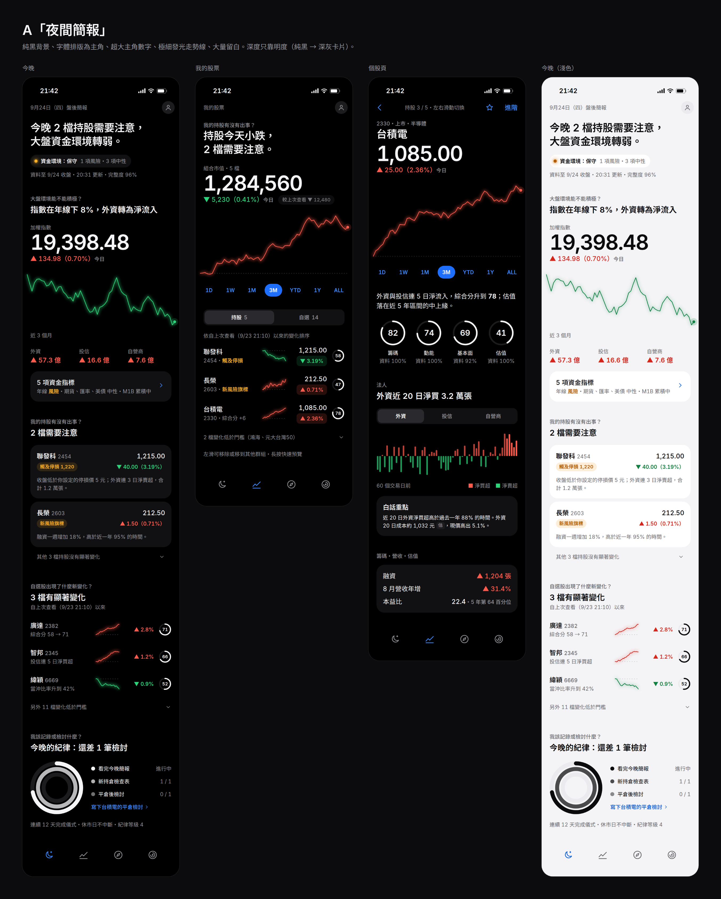
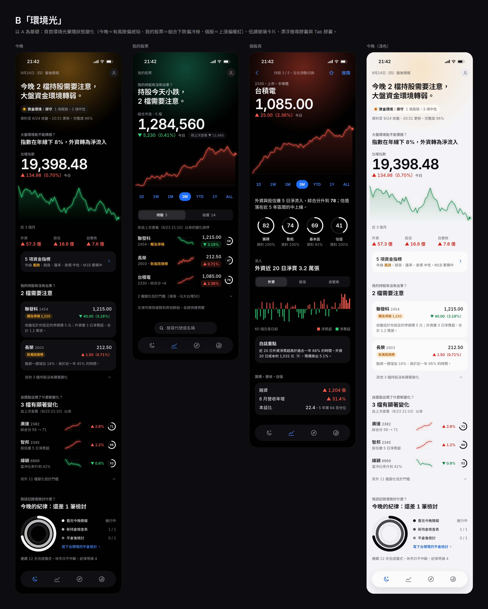
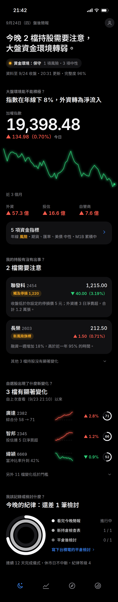
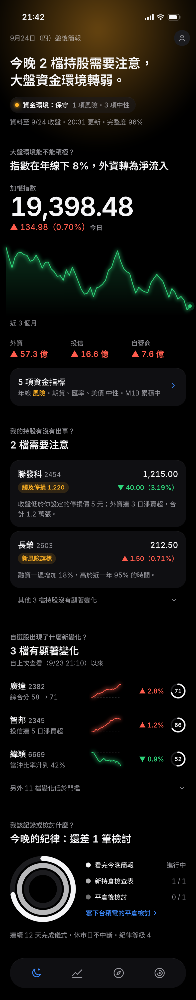
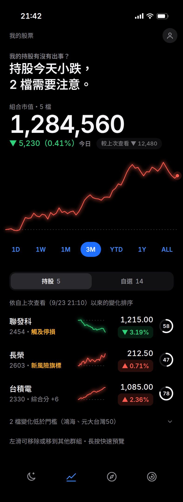
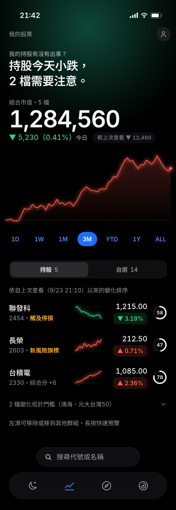
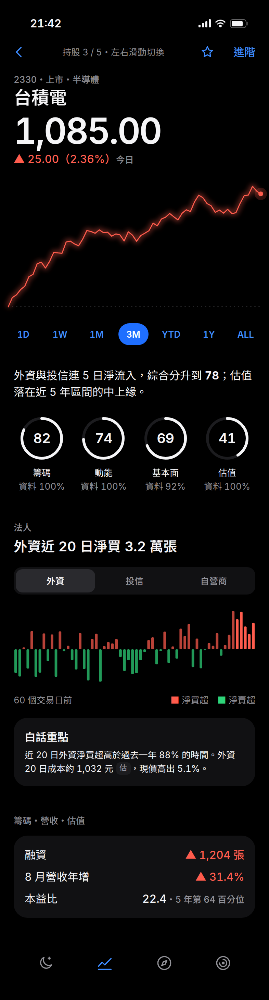
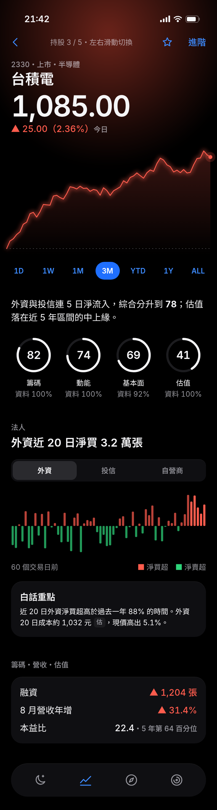
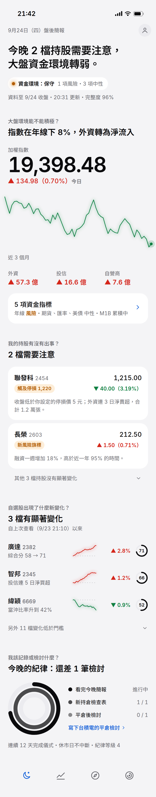
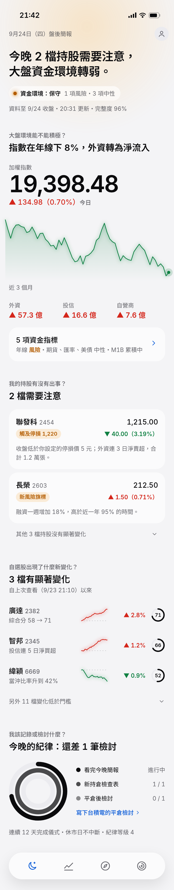

# 美術方向提案：A「夜間簡報」 vs B「環境光」

> **結果：選定 B「環境光」**，實作時修正了光暈語意（今晚＝資金環境；我的股票與個股＝所選期間漲跌、與走勢線同色）；mockup 中「我的股票」光暈與走勢顏色矛盾的問題已在實作中解決。實作後的畫面見 [screens/](screens/)。

三頁（今晚、我的股票、個股頁）的高保真 mockup，iPhone 393 × 852（@2x），另附「今晚」的淺色模式。資料為示意。

| | A「夜間簡報」 | B「環境光」 |
|---|---|---|
| 總覽 |  |  |
| 今晚 |  |  |
| 我的股票 |  |  |
| 個股頁 |  |  |
| 今晚（淺色） |  |  |

## 兩個方向的共同基礎

- **結論優先**：每頁第一行是一句白話結論；每個區塊先寫「在回答哪個問題」（小字），再給答案（區塊標題），再往下才是數字。
- **5 級字級**：主角數字 52、頁面標題 26、區塊標題 20、內文 16、輔助文字 13（行高都是 4 的倍數）。數字與英文用自託管的 Inter、等寬數字；中文用系統字體。
- **色彩預算**：灰階為主；紅漲綠跌只給漲跌；琥珀只給風險（觸及停損、風險旗標、資金環境保守）；電光藍只給可互動元素（期間選擇器、Tab、連結、按鈕）。分數環與紀律環用白色／灰階，不另加顏色。
- **資金環境燈號**：不用紅綠燈（避免和漲跌色衝突），改為「積極／中性／保守」三態文字＋圓點；只有「保守」用琥珀。
- **誠實呈現**：分數環下標示資料完整度；法人成本線等估算值加「估」字標籤；「另外 11 檔變化低於門檻」這類收合列清楚說明為什麼被隱藏。
- **深度**：以明度區分（純黑底 → 深灰卡片 → 浮起面板），不畫分隔線。
- **Tab**：4 個原創線條圖示、不加文字（今晚：月亮；我的股票：走勢線；探索：指南針；紀律：同心環）。

## 差異

- **A「夜間簡報」**：頁面完全純黑，走勢線只有細線＋微光，沒有面積填色；Tab bar 融入背景。最安靜、最省電（OLED），像在讀一份排版好的晚報。
- **B「環境光」**：頁首有一團柔和光暈，顏色跟著該頁的狀態變化（mockup 中：今晚＝有風險偏琥珀、我的股票＝組合下跌偏冷綠、個股＝上漲偏暖紅）；卡片、分段控制、Tab 都是半透明玻璃；走勢線下方有極淡的面積漸層；搜尋是漂浮在 Tab 上方的膠囊。情緒回饋更明顯，但也多一層視覺刺激。

## 重新產生

```bash
cd web && npm ci && cd ..
PW_CHROMIUM_PATH=/path/to/chromium node docs/design/mockups/render.mjs
```
