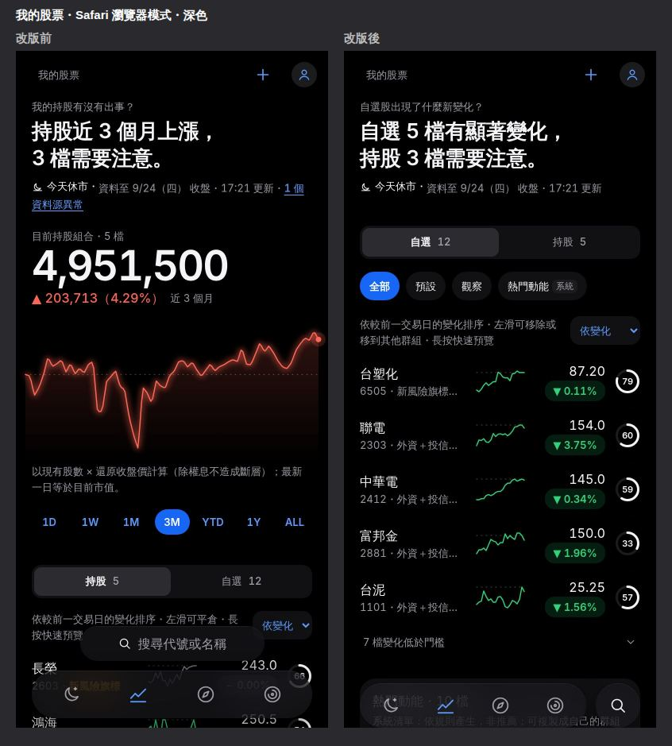
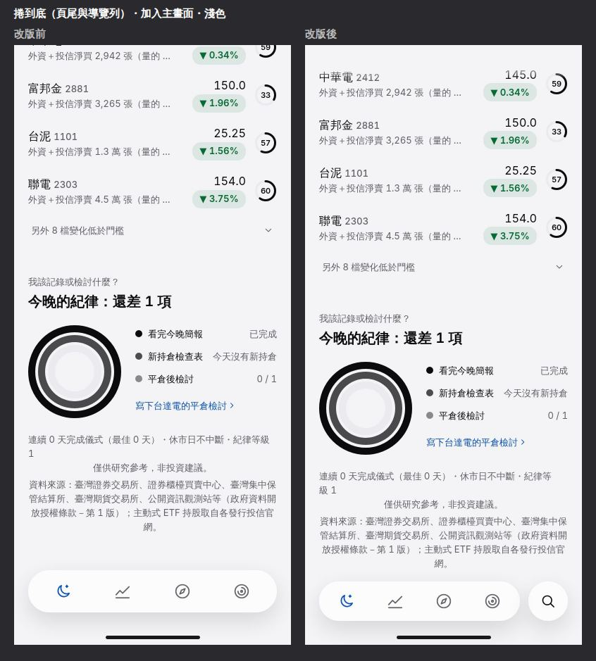
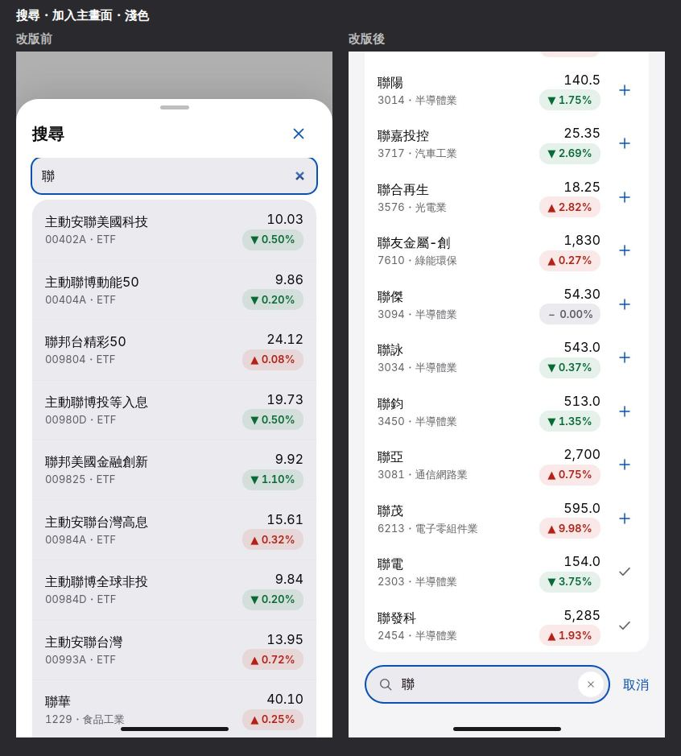
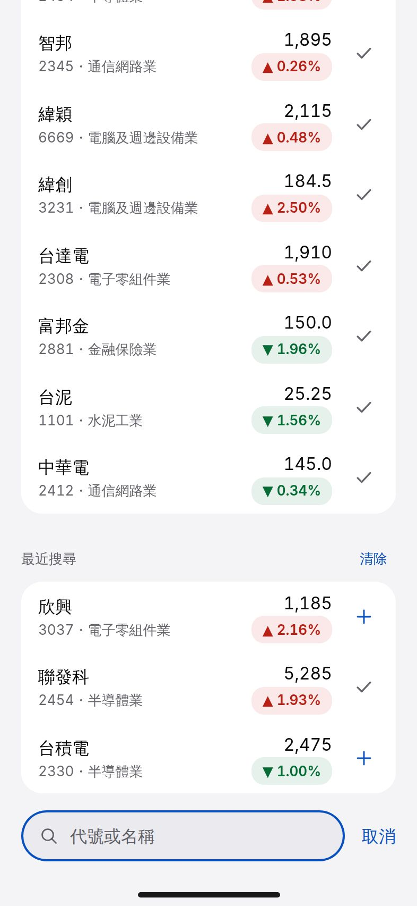
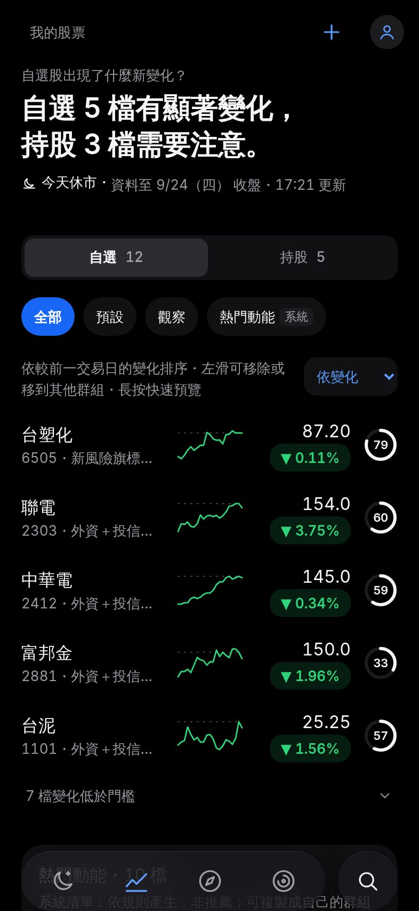
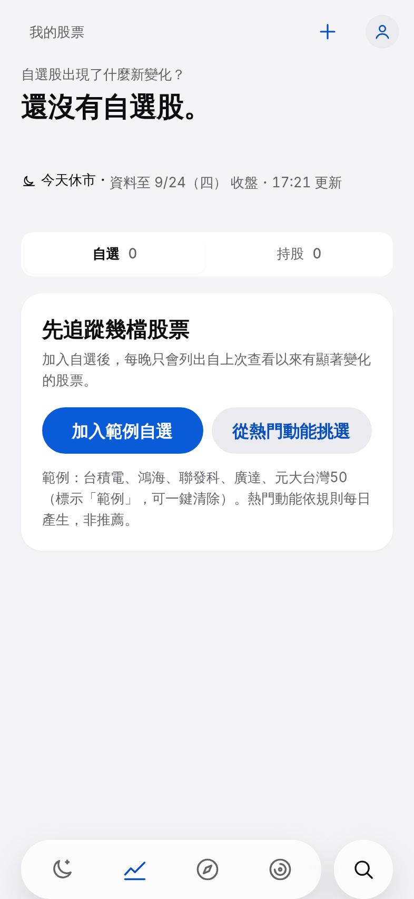
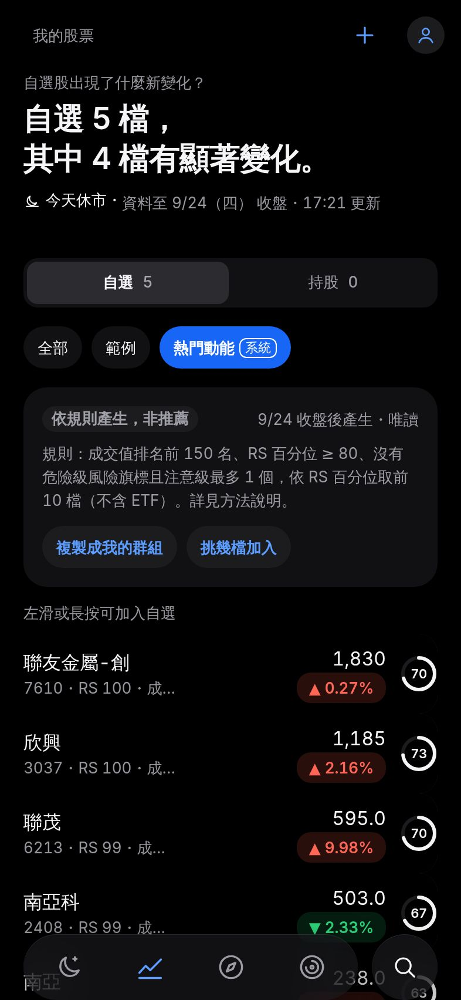
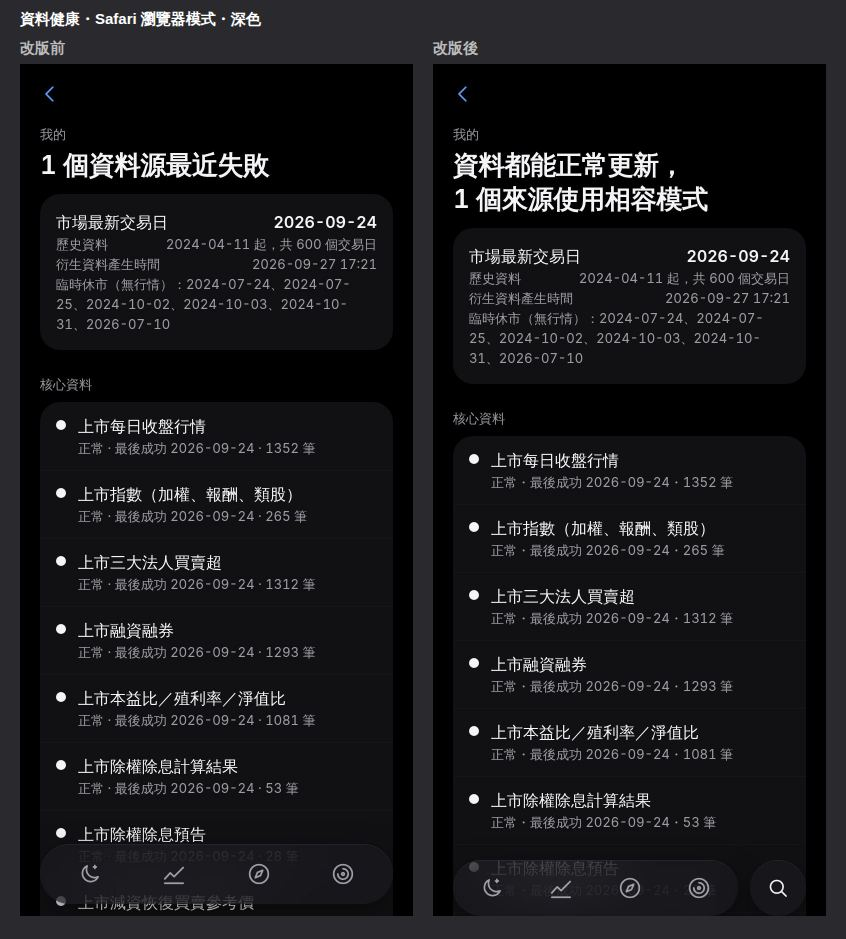
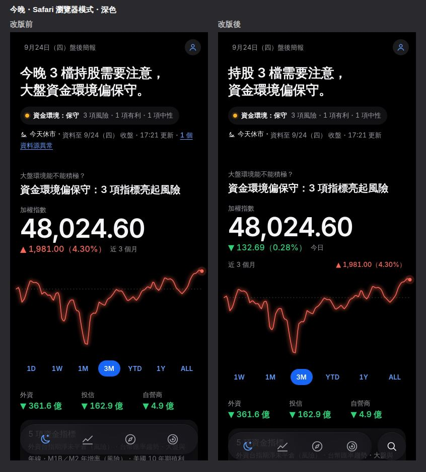

# 行動體驗修正（2026-09-27）

兩個角色協作：**設計師**從使用情境出發決定行為與視覺，對齊 iOS 26 的互動慣例與既有的 B「環境光」設計系統（tokens 在 `web/src/styles/tokens.css`，色彩預算不變：灰階為主、紅漲綠跌、琥珀只代表風險、電光藍只給可互動元素）；**工程師**找出根本原因，確保在 iPhone Safari（瀏覽器模式）與加入主畫面（standalone 模式）都正確，並補上測試。每一項依「問題 → 根本原因 → 設計決策 → 實作 → 驗收方式」記錄。決策摘要也寫在 [DECISIONS.md](../DECISIONS.md) 第 45–58 條。

截圖一律是 iPhone 393 × 852（@2x）、data 分支 600 個交易日的真實資料：

| 資料夾 | 內容 |
|---|---|
| [ux-fixes/before/](ux-fixes/before/) | 改版前（main `745d177`）：`{browser,standalone}-{dark,light}/` × 今晚、我的股票、搜尋、個股、資料健康、捲到底 |
| [ux-fixes/after/](ux-fixes/after/) | 改版後：同上，另有 `03b-search-empty`（沒有輸入時）與 `new-user/`（歡迎卡 → 範例自選 → 熱門動能 → 挑選） |
| [ux-fixes/compare/](ux-fixes/compare/) | 前後並排（每個模式 × 色彩 × 頁面一張） |

standalone 以 `<html class="standalone">` 模擬，safe-area 設為 iPhone 實際值（上 47、下 34）並畫出 Home 指示條；瀏覽器模式的 safe-area 為 0（Safari 網址列在頁面視窗之外）。重新產生：`web/scripts/ux-shots.mjs`、`web/scripts/ux-compare.mjs`（用法見 README「開發」）。

---

## 1. 底部導覽列太高（Safari 瀏覽器模式）

| | |
|---|---|
| 前 |  |
| 捲到底 |  |

**問題**：搜尋膠囊與 Tab bar 上下疊成兩層，加上 Safari 底部網址列，底部約 150px 都是固定元素，而且搜尋膠囊比 Tab 更高、離拇指更遠。

**根本原因**（工程師）
1. 搜尋是獨立的 `position: fixed` 膠囊，`bottom = safe-area + Tab 高度 + 24px`，永遠疊在 Tab 上方。
2. Tab 的 `bottom = safe-area + 12px`：在 safe-area 之外又疊一段 margin；standalone 下（safe-area 34px）Tab 距離螢幕底部 46px。
3. 內容底部保留 `Tab 高度 + safe-area + 48px`，有漂浮膠囊的頁面再加 72px，和實際固定元素的高度對不上：有的頁面最後一段被遮住、有的頁面底部多一大塊空白。
4. 瀏覽器模式與 standalone 沒有分開處理：standalone 的狀態列（black-translucent）底下也沒有背景，內容捲上去會和時間、電量重疊。

**設計決策**（設計師）
- 對齊 iOS 26：Tab 膠囊＋右側**獨立的圓形搜尋按鈕**，兩者同一列、同高（56px），合併成一列。搜尋按鈕用 `--text-1` 的線條放大鏡，和 Tab 一樣是玻璃材質，不另加顏色。
- 往下捲動時縮小成精簡型態（56 → 44px、膠囊收窄），**往上捲、停止捲動約 0.7 秒、或換頁時恢復**。和 iOS 不同的是精簡型態仍保留 4 個 Tab 可點（這個 App 在儀式中常切頁，不希望多一步展開）。
- 導覽列和螢幕底部之間「只有 safe-area」：瀏覽器模式緊貼 Safari 網址列上方；加入主畫面時浮在 Home 指示條上方。

**實作**
- `Dock`（`web/src/components/Chrome.tsx`）取代 `TabBar`＋`SearchFloat`；`useScrollCompact` 以 rAF 節流、6px 門檻避免手指微動造成閃爍。
- CSS（`global.css`「底部導覽」）：`.dock { position: fixed; bottom: 0; padding-bottom: var(--dock-pad) }`，不再有任何 margin。`--dock-pad` 在瀏覽器模式＝`env(safe-area-inset-bottom)`；`@media (display-mode: standalone)` 與 `:root.standalone` 下為 `max(safe-area, 8px)`（Face ID 機型＝34px；只有實體 Home 鍵機型 safe-area 為 0 時才用 8px 下限）。`main.tsx` 依 `matchMedia('(display-mode: standalone)')` 或 `navigator.standalone` 在 `<html>` 加上 `.standalone`。
- `--dock-h = --tabbar-h + --dock-pad`；`.app` 的底部 padding **剛好等於** `--dock-h`，頁尾免責聲明不會被遮住，也沒有多餘空白。
- 版面高度用 `dvh`（`body`、`.app`、`.page-body`、底部面板、搜尋頁的後備高度）。
- standalone 另加 `.status-scrim`：狀態列高度的背景漸層。

**驗收方式**
- Playwright（`web/e2e/ux-fixes.spec.ts`「1. 底部導覽列」，393 × 852）：Tab 與搜尋按鈕中心同一高度、按鈕在右側且為圓形；瀏覽器模式 Tab 下緣＝視窗底緣；standalone 模擬下 Tab 下緣到視窗底緣＝34px（safe-area）、`.dock` 本身 `bottom: 0`；兩種模式捲到最底時 `.app` 的底部 padding＝導覽列高度，且頁尾下緣 ≤ Tab 上緣；往下捲出現精簡型態、往上捲或停止後恢復。
- 截圖：`compare/*-06-tonight-bottom.jpg`（四種組合）。
- 真機：README「手動驗收清單」第 1 項。

---

## 2. 搜尋頁的輸入框位置

| 有輸入 | 沒有輸入 |
|---|---|
|  |  |

**問題**：搜尋是全頁面板，輸入框在頁面頂端，單手很難點到；輸入框上緣的焦點外框被切掉一半。搜尋「聯」時前 9 筆都是名稱中間有「聯」的 ETF，真正要找的聯發科、聯電排在後面。

**根本原因**
1. 輸入框在 `.sheet-body`（`overflow-y: auto`）的第一個元素，焦點框是 `box-shadow: 0 0 0 2px`（畫在外側），上緣超出捲動容器被裁切。
2. 比對只做「代號開頭或名稱包含」且依原始順序取前 12 筆，沒有相關性排序。
3. 面板高度用 `100dvh`，但 iOS 開鍵盤時 `dvh` 不會縮小（鍵盤蓋在版面上），若把輸入框放在底部會被鍵盤擋住；iOS Safari 還會把整個版面往上推，固定在底部的元素會跟著位移。

**設計決策**
- 搜尋是獨立頁面 `#/search`（可返回、可分享），從底部導覽的圓形按鈕進入；進入時底部導覽換成**底部搜尋列**（輸入框＋「取消」），鍵盤出現時搜尋列貼在鍵盤正上方。
- 結果在搜尋列上方**由下往上**排列：最相關的最靠近拇指。沒有輸入時由下往上是「最近搜尋」（最靠近拇指）、「自選股」、「熱門動能前 5 名（依規則產生，非推薦）」，最上面一行提示可以輸入什麼。
- 比對：代號、中文名稱、名稱部分比對（「台積」「聯發」），也接受名稱依序包含的字（「大光」→ 大立光）；全形數字自動轉半形。排序：代號完全相同 > 名稱完全相同 > 代號開頭 > 名稱開頭 > 名稱包含 > 名稱依序包含，同分時成交值大的在前。
- 點結果進入個股頁並記入最近搜尋；在結果列上**左滑**直接加入自選（滑過 72px 出現電光藍的「加入自選」，放開即加入），列尾的＋按鈕提供不需要手勢的同一個動作（無障礙與可發現性）。已在自選的顯示 ✓。

**實作**
- `web/src/pages/Search.tsx`：`useVisualViewport` 把 `visualViewport.height`、`offsetTop` 與鍵盤高度（`innerHeight − vv.height − vv.offsetTop`）寫成 `--vv-h`、`--vv-top`、`--kb`；`.search-screen` 以 `position: fixed; top: var(--vv-top); height: var(--vv-h)` 固定在**可見區域**內，鍵盤開啟時高度縮小、搜尋列自然貼在鍵盤上方，iOS 往上推的位移由 `offsetTop` 抵銷。鍵盤開啟時（`data-kb="open"`）搜尋列不再補 safe-area（被鍵盤蓋住）。搜尋期間 `html { overflow: hidden }`，只有結果清單捲動。
- iOS 只在使用者手勢內聚焦輸入框才會叫出鍵盤：點搜尋按鈕時 `primeKeyboard()` 先同步聚焦一個隱形輸入框，搜尋頁掛載後把焦點移到真正的輸入框（鍵盤保持開啟）。輸入框字級 16px，避免 iOS 聚焦時放大頁面。
- 焦點框：`.input:focus`、`.search-field:focus-within`、結果列都改為 `box-shadow: inset 0 0 0 2px`（畫在內側），任何容器都不會裁切。
- 結果由下往上：DOM 仍是「最相關在前」（螢幕閱讀器與 Tab 順序正確），以 `column-reverse` 顯示；鍵盤 ↑ 從輸入框移到最相關的結果、↓ 回到輸入框，Enter 開啟第一筆，Esc 取消。
- 比對與排序是純函式 `web/src/lib/search.ts`（加入自選面板 `StockSearch` 也改用它）；最近搜尋存在 IndexedDB 設定（最多 8 筆）。
- 沒有輸入時，所有來源（全市場清單、最近搜尋、自選、熱門動能）到齊才一次畫出，避免區塊先後出現把彼此往上推（Lighthouse CLS 0.20 → 0）。結果列不用 listbox（列內有＋按鈕），改為清單＋按鈕（Lighthouse 無障礙 94 → 100）。

**驗收方式**
- Playwright「2. 搜尋頁」：搜尋按鈕 → `#/search`、輸入框已聚焦且位於畫面底部、焦點框為 inset、底部導覽隱藏；`2330`、`台積`、`鴻` 的第一個結果正確且在視覺上最下面；找不到時有說明；點結果進入個股頁並出現在「最近搜尋」；＋按鈕與左滑（滑鼠拖曳模擬）都能加入自選，並在我的股票看到；鍵盤 ↑／↓／Esc。
- 單元測試 `web/src/lib/search.test.ts`：正規化、代號與名稱排序、部分比對、空輸入。
- **真機**（Chromium 無法模擬 iOS 鍵盤）：README「手動驗收清單」第 2 項——鍵盤自動彈出、輸入框貼在鍵盤上方、頁面不晃動、旋轉與切換輸入法、左滑加入。

---

## 3. 我的股票：自選優先，並對新用戶更友善

| 自選預設 | 新用戶 | 熱門動能 |
|---|---|---|
|  |  |  |

**問題**：分段控制是「持股｜自選」且預設持股；多數時間使用者是在看自選的變化。沒有自選的新用戶只看到空狀態，不知道從哪裡開始。

**根本原因**：資訊架構沿用舊版「日誌優先」的順序；空狀態只有「加入自選股」一個入口，需要使用者自己知道要找哪些股票。

**設計決策**
- 分段改為「**自選｜持股**」，自選在左且預設（`#/mine`；持股為 `#/mine?seg=hold`，舊網址 `?seg=watch` 仍有效）。持股組合的主角走勢移到持股分段；自選分段的環境光為中性。
- 頁首結論以自選為主，有持股時再加上持股狀況：「自選 8 檔，其中 2 檔有顯著變化。」／「自選 2 檔有顯著變化，持股 1 檔需要注意。」（寫法同時符合第 6 項的兩行限制）。
- 新增系統清單「**熱門動能**」：每個交易日依規則自動產生（成交值排名前段、RS 百分位高、風險旗標少），顯示為自選群組膠囊中的唯讀群組（膠囊上有「系統」小標），清單上方固定標示「依規則產生，非推薦」、產生日期與規則全文；可「複製成我的群組」（建立「熱門動能 M/D」），或「挑幾檔加入」（勾選面板）；列上左滑或長按預覽也能加入單檔。「全部」的清單最下方有一張入口卡。
- 新用戶還沒有任何自選時，自選分段只顯示一張精簡的歡迎卡：「加入範例自選」（主要按鈕）與「從熱門動能挑選」。範例自選放在「範例」群組並在清單上方顯示「範例自選…隨時可以清除」＋「清除範例」。

**實作**
- pipeline：`pipeline/derive/lists.py` 依 `config/ui.yml` 的 `hot_momentum` 規則，在 `build-web` 時由 summary 產生 `lists.json`；規則寫在 [METHODOLOGY.md](../METHODOLOGY.md) 第 9 節，也由方法說明頁自動列出。範例清單在 `config/ui.yml` 的 `sample_watchlist`。
- IndexedDB **v3**：自選新增 `origin`（`user`／`sample`／`hot`）與索引。升級在 versionchange 交易中逐筆補 `origin: 'user'`，其他資料原樣保留；備份匯入的 `EXPORT_MIGRATIONS[3]` 做同樣的事。`addWatchMany`（同一交易一次加入、已存在的略過）、`clearSampleWatch`（只刪 `origin = 'sample'`）；範例股被使用者移到其他群組時視為留下，來源改為 `user`。
- `web/src/pages/Mine.tsx`：`WelcomeCard`、`HotPickSheet`、`HotHeader`；熱門動能群組的列沒有「移除／移群組」動作（唯讀），只有「加入自選」。

**驗收方式**
- Playwright「3. 我的股票」：分段順序與預設、`?seg=hold` 與舊網址；歡迎卡 → 加入範例（出現台積電、鴻海與「範例」群組、結論以自選開頭）→ 清除範例回到歡迎卡；從熱門動能勾選 1 檔加入；熱門動能群組顯示「依規則產生，非推薦」與規則、複製成群組；**先在同源建立 v2 資料庫再開 App**，自選與群組都保留、不出現歡迎卡。
- 單元測試：`db.test.ts`（v2 → v3 升級保留自選／設定並補來源、範例加入與清除、最近搜尋、v2 備份升級）、`pipeline/tests/test_lists.py`（規則、排序、缺值、預設設定）。
- 截圖：`after/new-user/`（深淺色各 4 張）。

---

## 4. 資料源異常：上櫃本益比／殖利率／淨值比

| 資料健康頁 | 頁首提示 |
|---|---|
|  |  |

**問題**：`找不到欄位「財報年/季」；實際欄位為 ['股票代號','公司名稱','本益比','每股股利','股利年度','殖利率(%)','股價淨值比']`。每一頁頁首都出現藍色的「1 個資料源異常」連結，資料健康頁直接顯示這串技術訊息。

**根本原因**
1. 實測櫃買 `peQryDate`：**2025 年起**的回應有 8 欄（含「財報年/季」），**2024 年（含）以前**只有 7 欄。回補 2024 年的日期時，解析器要求 mapping 裡每個欄名都存在，整批丟 `ParseError`；data 分支的 manifest 顯示 `tpex_valuation` 連續失敗 180 次，2024 年的上櫃本益比完全沒有資料。
2. 最新資料（2026-09-24）其實正常，但 manifest 只記「最後一次嘗試」的狀態，回補失敗會蓋掉每日任務的成功，前端把它當成「目前資料異常」顯示在所有頁面。
3. 頁首提示不看頁面用到哪些資料，也用了代表「可互動」的電光藍，視覺權重比資料本身還高。

**設計決策**
- 解析器改為「**欄位別名＋必要／選用欄位**」：必要欄位缺少才失敗；其他欄位缺少時補空值並記錄「格式變動警告」，資料照常寫入。本益比表的必要欄位只有代號、本益比、殖利率、淨值比；「財報年/季」為選用。
- 所有解析器共用同一策略：未特別指定時只有代號必要，關鍵數值欄位由 registry 的 `Spec.numeric` 在驗證階段把關；以位置解析的表格（欄名重複）只接受「最後多出欄位」。
- 一般使用者看到白話：「櫃買中心調整了資料格式，已改用相容模式」「回補較早的歷史資料時失敗，最新資料不受影響」「證交所網站暫時連不上，下次排程會自動重試」；技術訊息、格式變動警告、連續失敗次數、來源 id 收在「詳細資訊」。狀態點只有「影響最新資料」的異常用琥珀，相容模式與等待用空心。
- 頁首「N 個資料源異常」只在**該頁實際用到的資料**受影響、而且影響的是最新資料時才出現，改為琥珀色小字（仍可點進資料健康頁）。

**實作**
- `pipeline/sources/base.py`：`Col`／`opt()`／`col()`、`resolve_fields`、`frame_from_fields(..., required=, source=)`、`expect_fields` 的相容規則、`warn_format` 與 `collect_format_warnings()`；欄名正規化也處理全形括號與百分號。`twse.parse_valuation`、`tpex.parse_valuation` 設定必要欄位與別名。
- manifest：`RunContext.note` 取走累積的警告，`store.record` 寫入 `sources.{id}.format_warnings`／`format_warning_date`（有警告就記錄；一次沒有警告的成功解析才清除）；每次執行摘要也列出有警告的來源。`build_health` 輸出 `affects_latest` 與 `format_warnings`，`meta.json` 新增 `sources_affected`。
- 冒煙測試：新指令 `python -m pipeline smoke --date … [--source …] [--strict]`（`pipeline/smoke.py`）對每個已登錄來源抓取＋解析，檢查必要欄位（`Spec.keys`＋`Spec.numeric`）存在且可解析，輸出 Markdown 表格；`smoke-test.yml` **新增** `fields` job 執行它（原本的 `probe` job 未改），有格式變動時 job 失敗。
- 前端：`web/src/lib/health.ts`（`describeSource`、`healthConclusion`、`PAGE_SOURCES`、`affectedFor`）、`Health.tsx`（白話＋`
`）、`DataStatus` 的 `uses` 參數與 `.meta-alert` 樣式。
- 樣本：`tests/fixtures/samples/tpex_pe_hist.json`（2024-01-02，舊格式，本環境抓取後以 `make_samples.trim_json` 裁切）；原本的 `tpex_pe.json`（新格式）保留。

**驗收方式**
- pytest：兩種格式都能解析（舊格式 `fin_period` 為空並有 1 則警告；新格式沒有警告）、刪掉必要欄位「股價淨值比」會失敗、欄名改成別名（「證券代號」「殖利率（％）」）仍可解析並警告；`test_format_tolerance.py`（別名、選用、預設必要欄位、位置表格、警告去重、manifest 保留／清除、冒煙測試的必要欄位檢查）；`test_tasks.py` 以回放樣本跑 `run_daily_source`：舊格式寫入成功、manifest 記錄警告、執行摘要列出來源，之後新格式成功時清除。
- 本機以真實端點執行 `python -m pipeline smoke --date 2024-01-02 --source tpex_valuation,…`：`tpex_valuation` 為「⚠️ 相容模式」812 筆。
- Playwright「4. 資料源異常」：攔截 `meta.json` 讓集保異常 → 今晚頁（沒用到集保）不顯示提示、個股頁顯示「1 個資料源異常」且顏色＝`--risk`、不是 `--brand`；攔截 `health.json` 加上格式警告 → 顯示「櫃買中心調整了資料格式，已改用相容模式」，技術訊息在展開「詳細資訊」後才出現。
- Actions：合併前在本分支以 Data workflow（task=backfill、source=tpex_valuation）重跑回補，結果見 PR 說明。

---

## 5. 今晚頁的主角數字

**問題**：預設期間是 ALL，主角數字下方顯示「+131% 全部期間」，對當晚簡報沒有意義。

**根本原因**：今晚頁共用個股頁的 `HeroChart` 與 `usePeriod`：主角數字下方永遠是「所選期間」的漲跌，而且期間記在 localStorage（`period:taiex`），使用者曾經選過 ALL 之後每晚都是 ALL；1D 只有兩點（只有盤後日資料）。

**設計決策**
- 主角數字下方**一律是「今日」**的漲跌點數與漲跌幅（拖曳查看時為該日對前一日），這是盤後簡報的第一個問題「今天發生什麼事」。
- 走勢圖預設 3M；期間選擇器只改變走勢圖，並在圖表上方標示目前期間的區間漲跌（「近 3 個月　▲ 1,981.00（4.30%）」）；選項從 1W 開始。
- 今晚頁不記憶期間：每晚都從 3M 開始。

**實作**：`HeroChart` 新增 `heroChange="daily"` 與 `periods` 參數（`TONIGHT_PERIODS`、`TONIGHT_DEFAULT_PERIOD` 在 `lib/periods.ts`），新增 `.chart-range`；今晚頁改用 `useState('3M')`。我的股票與個股頁行為不變。

**驗收方式**：Playwright「5.」：期間第一個是 1W、沒有 1D、3M 為預設；主角數字下方含「今日」；切到 1Y 後圖上方變「近 1 年」而主角數字下方文字不變。

---

## 6. 中文排版

**問題**：結論句在手機寬度會出現「化，」單獨掉到下一行，或一句話折成三、四行。

**根本原因**：結論句由兩個子句以 ` ` 強制分行，每個子句本身又超過一行寬（標題 26px 在 393 寬約 13.5 個全形字）；CJK 預設每個字之間都可以換行，瀏覽器只會把放不下的最後一兩個字（含標點）推到下一行。

**設計決策**
- 標題與結論句 `text-wrap: balance`（不支援時退回 `pretty`）；`word-break: keep-all`＋`line-break: strict`：只在標點與空白處換行；數字前後改用不換行空白，實際上只會在「，」之後換行。
- 改寫結論：每個子句 ≤ 12 個全形字寬、整句最多兩行，例如「持股 3 檔需要注意，資金環境偏保守。」「自選 8 檔，其中 2 檔有顯著變化。」

**實作**：`global.css`（`.title`、`.section` 等）、`lib/conclusion.ts`（`tonightConclusion`、`mineConclusion`、`holdConclusion`，改為回傳整句）、頁面不再用 ` `。

**驗收方式**：單元測試檢查所有結論組合的子句寬度與子句數；Playwright「6.」在 393 寬實測今晚與我的股票的結論行數 ≤ 2 且 `word-break: keep-all`；截圖 `compare/*-01-tonight.jpg`、`*-02-mine.jpg`。

---

## 7. 驗收與交付

| 項目 | 目標 | 結果 |
|---|---|---|
| 既有測試 | 全部通過 | pytest 157 → 173；vitest 78 → 95；Playwright 50 → 68（新增 `ux-fixes.spec.ts` 18 項，其中第 1–3 項 14 項）；ruff、mypy、eslint、tsc 全過 |
| 首次載入 JS（gzip） | < 250 KB | **42.6 KB**（index＋預載的共用 chunk；搜尋頁為獨立 lazy chunk） |
| Lighthouse 行動版（真實資料、gzip，與 GitHub Pages 相同） | ≥ 90 | 今晚 93、我的股票 91、搜尋 93、個股 97、資料健康 99；無障礙／最佳做法／SEO 全部 100（搜尋頁修正前為無障礙 94、CLS 0.20） |
| WCAG AA 對比 | ≥ 4.5:1 | 深色最低 4.93:1、淺色最低 5.03:1（`web/scripts/contrast.py`）；新增的琥珀小字、選取中的「系統」小標、搜尋框提示文字都使用既有通過檢查的顏色組合 |

Lighthouse 備註：以不壓縮的靜態伺服器量測時，今晚頁改版前後都是 76（`summary.json` 未壓縮約 700 KB），瓶頸在資料量而不是這次的修改；GitHub Pages 會以 gzip 傳送（約 230 KB）。

## 仍未完成／需要真機確認

1. **iOS 鍵盤行為**只能在真機驗證（見 README 手動驗收清單）：`primeKeyboard` 的焦點轉移是常見做法，但各 iOS 版本的行為可能不同；若進入搜尋頁時鍵盤沒有自動彈出，只需再點一次輸入框，其餘行為（貼在鍵盤上方）不受影響。
2. **iOS 26 Safari 的網址列**會隨捲動縮放；我們只依 `env(safe-area-inset-bottom)` 定位，若 Safari 將來把網址列疊在頁面上而不回報 inset，需要再調整。
3. **精簡型態**只縮小高度與寬度，沒有做成 iOS 26 那樣只留目前的 Tab（見第 1 項設計決策）。
4. **熱門動能**只在每次部署時產生；盤中不會變動。規則的門檻是事前設定，沒有做資料最佳化。
