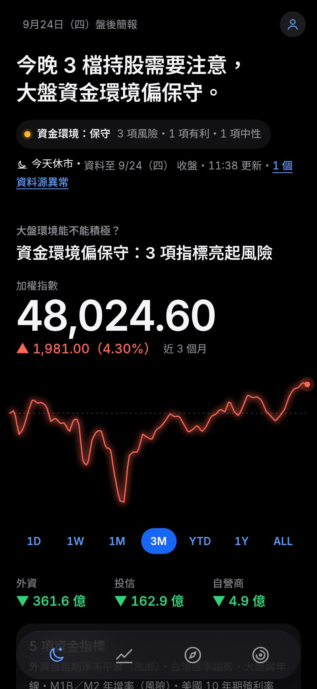
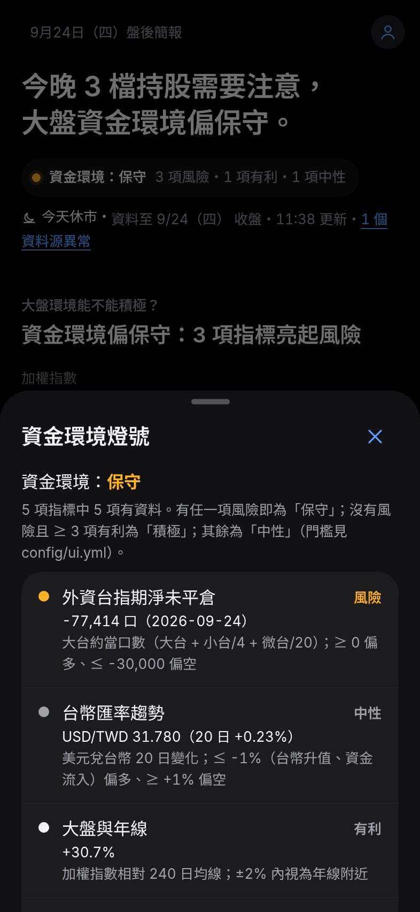
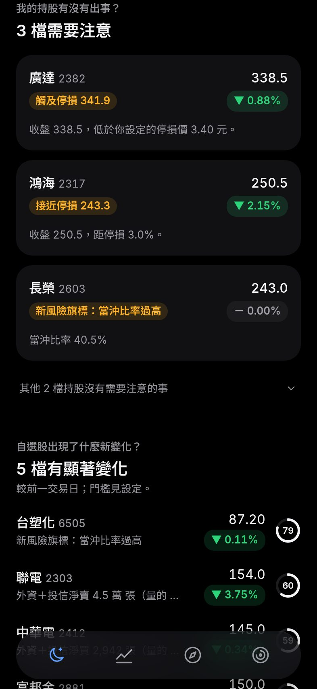
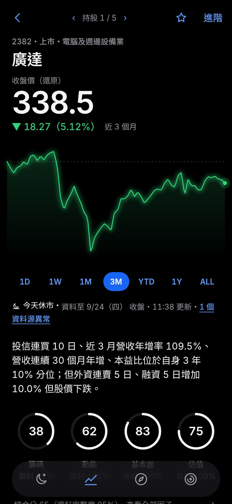
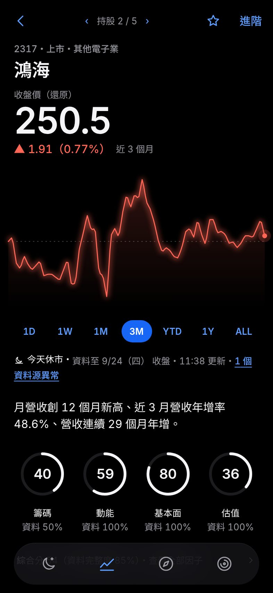
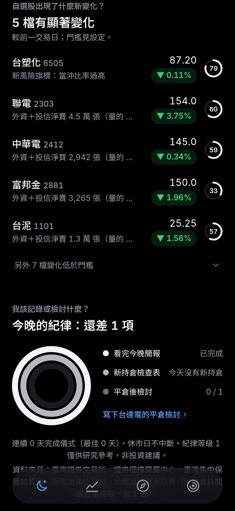
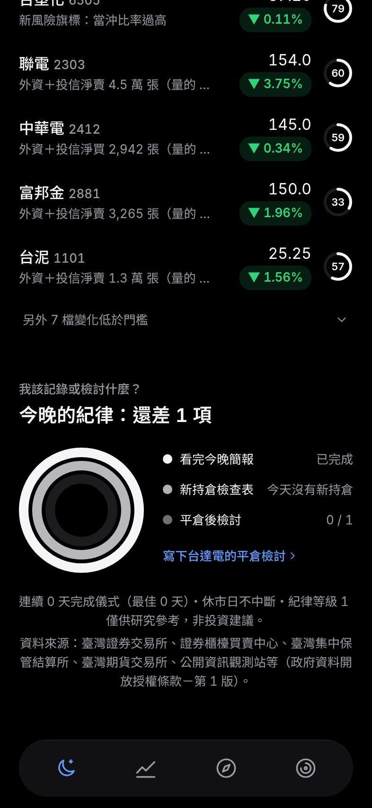
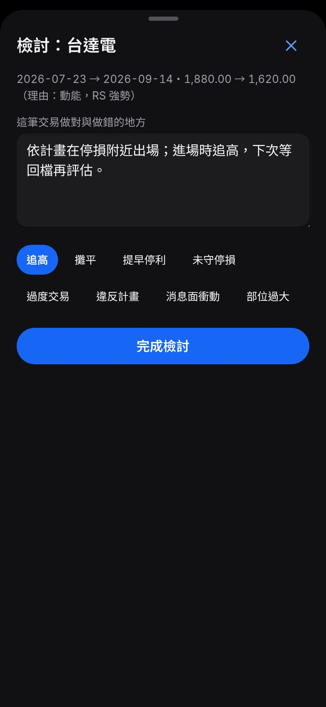
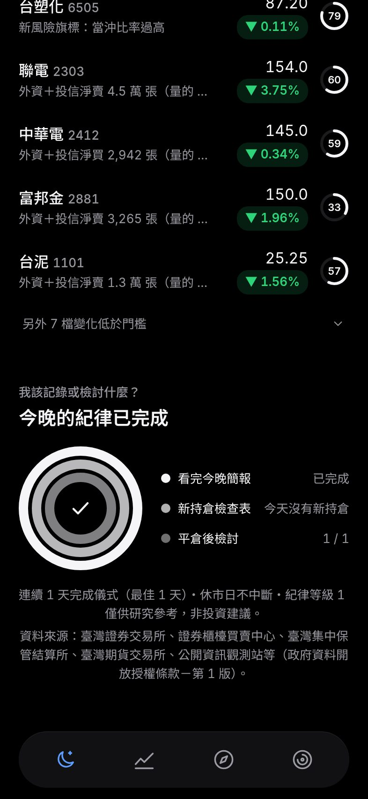

# 「每晚 5 分鐘儀式」走查

情境：上班族晚上打開 App，持有 5 檔股票（其中 1 檔觸及停損、1 檔接近停損、1 檔出現新風險旗標），追蹤 12 檔自選股，上週平倉的台達電還沒寫檢討。市場資料為 data 分支的真實資料（資料至 2026-09-24）。

- 腳本：`web/scripts/walkthrough.mjs`（Playwright，iPhone 393 × 852、深色）。
- 計算方式：每一次點擊（tap）算 1 次；捲動與打字不計入。
- 結果：**從打開 App 到完成三環共 9 次點擊**（目標 ≤ 15）。其中第 2、3、4、5 次是查看細節（燈號面板、持股個股頁、下一檔），只想完成三環時最少 3 次（寫下檢討、完成檢討、回到今晚）。

| 步驟 | 截圖 | 說明 | 累計點擊 |
|---|---|---|---|
| 1 |  | 打開 App：今晚頁最上方一句話結論與資金環境燈號（環境光為琥珀＝資金環境保守）。 | 0 |
| 2 |  | 點燈號：底部面板列出 5 項資金指標，哪一項亮起風險、依據是什麼。 | 1 |
| 3 |  | 往下捲：持股警示——觸及停損、接近停損、新風險旗標，其餘持股收合。 | 2 |
| 4 |  | 點警示卡：個股頁先給主角數字、走勢、一句話健檢與四環分數。 | 3 |
| 5 |  | 下一檔（也可左右滑動）：依序看完需要注意的持股。 | 4 |
| 6 |  | 回到今晚、捲到自選股的新變化：只列出自上次查看以來超過門檻的變化。 | 5 |
| 7 |  | 捲到底：第一環「看完今晚簡報」自動完成；還差平倉檢討。 | 5 |
| 8 |  | 點「寫下平倉檢討」：直接開啟檢討面板，打字不算點擊；加上錯誤標籤。 | 7 |
| 9 |  | 回到今晚：三環完成，播放一次低調的完成動畫；連續天數與紀律等級更新。 | 9 |

**總點擊次數：9 次**（目標 ≤ 15）。捲動與打字不計入。